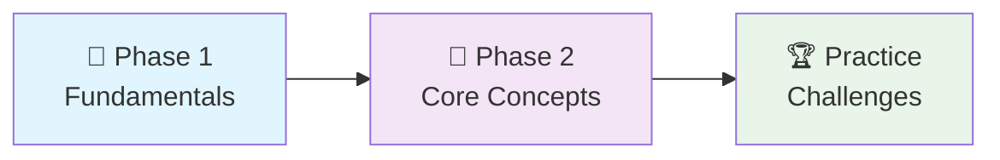

# 🚀 C Programming Fundamentals: Complete Learning Journey

<div align="center">


[](README.md)
[](README.md)
[](README.md)

### 🎯 Master C Programming from Zero to Hero

*A structured, hands-on approach to learning C programming fundamentals*  

</div>

---

## 🌟 Why This Course?

This repository provides a **complete learning pathway** for C programming beginners. Unlike scattered tutorials, this course offers:

- 📚 **Structured Learning**: Progressive difficulty with clear milestones
- 💻 **Hands-On Practice**: 12 code files with detailed examples
- 🏆 **Challenge-Based**: 22+ practice problems to reinforce learning
- 📖 **Self-Paced**: Learn at your own speed with clear progress tracking
- 🎓 **Student-Tested**: Designed specifically for Class 10-12 students

---

## 📚 Table of Contents

- [🚀 Quick Start Guide](#-quick-start-guide)
- [🎯 Learning Path Overview](#-learning-path-overview)
- [📖 Course Modules](#-course-modules)
- [🏆 Practice Challenges](#-practice-challenges)
- [💻 Essential Code Examples](#-essential-code-examples)
- [📈 Progress Tracking](#-progress-tracking)
- [🎓 What's Next?](#-whats-next)
- [🤝 Resources & Support](#-resources--support)

---

## ⚡ Quick Start Guide

### Prerequisites

- Any C compiler (GCC, Dev-C++, Code::Blocks)
- Text editor or IDE
- Enthusiasm to learn! 🔥

### Getting Started

```bash
# 1. Clone the repository
git clone https://github.com/rohit528590/CGenesis.git

# 2. Navigate to the project
cd CGenesis

# 3. Start with Phase 1
# Open 01_First.c and begin your journey!
```

### Your First Program

```c
#include <stdio.h>
int main() {
    printf("Hello, C Programming World!\n");
    return 0;
}
```

---

## 🎯 Learning Path Overview

<div align="center">



</div>

---

## 📖 Course Modules

### Phase 1: Foundation Building 🌱

*Master the absolute basics of C programming structure and syntax*  

| # | Module | File | Key Concepts | Difficulty |
|---|--------|------|-------------|------------|
| 1 | **First Program** | [First.c](01_First.c) | Hello World, Program execution | ⭐ |
| 2 | **Program Structure** | [Boilerplate_code.c](02_Boilerplate_code.c) | `#include`, `main()`, `return` | ⭐ |
| 3 | **Documentation** | [Comments.c](03_Comments.c) | Single-line, Multi-line comments | ⭐ |
| 4 | **Output Formatting** | [Escape_Sequence.c](04_Escape_Sequence.c) | `\n`, `\t`, Special characters | ⭐ |

**🎯 Phase 1 Milestone**: Write and execute basic C programs with proper formatting

---

### Phase 2: Core Programming Concepts 🔧

*Learn variables, data types, and fundamental operations*  

| # | Module | File | Key Concepts | Difficulty |
|---|--------|------|-------------|------------|
| 5 | **Variables** | [Variable_Declaration.c](05_Variable_Declaration.c) | Declaration, Initialization | ⭐⭐ |
| 6 | **Naming Rules** | [Variable_naming_rules.c](06_Variable_naming_rules.c) | Best practices, Conventions | ⭐⭐ |
| 7 | **Arithmetic** | [Airthmetic(Moduls)_Operator.c](07_Airthmetic(Moduls)_Operator.c) | Math operations, Modulus | ⭐⭐ |
| 8 | **Data Types** | [Data_Types.c](08_Data_Types.c) | `int`, `float`, `char`, Specifiers | ⭐⭐ |
| 9 | **Input/Output** | [Input_Output.c](09_Input_Output.c) | `scanf()`, `printf()`, User input | ⭐⭐ |
| 10 | **Operator Precedence** | [Hierarchy_of_operators.c](10_Hierarchy_of_operators.c) | Order of operations | ⭐⭐⭐ |
| 11 | **Type Casting** | [TypeCasting.c](11_TypeCasting.c) | Data conversion, Casting | ⭐⭐⭐ |
| 12 | **Memory Concepts** | [Size_of_Data_Types.c](12_Size_of_Data_Types.c) | `sizeof()`, Memory allocation | ⭐⭐⭐ |

**🎯 Phase 2 Milestone**: Create interactive programs that process user input and perform calculations

---

## 🏆 Practice Challenges

### 📁 Challenge Categories - [Practice_Questions.txt](Practice_Questions.txt)

<details>
<summary>🟢 <strong>Level 1: Basic Operations</strong> (Complete after Phase 1)</summary>

Perfect for building confidence with simple input/output operations.

| Challenge | Skills | Estimated Time |
|-----------|---------|----------------|
| Sum of two numbers | Variables, I/O | 15 minutes |
| Calculate cube | Arithmetic operations | 15 minutes |
| Square perimeter | Basic formulas | 20 minutes |
| Rectangle area & perimeter | Multiple inputs | 25 minutes |

**Goal**: Master basic programming structure and simple calculations

</details>

<details>
<summary>🟡 <strong>Level 2: Mathematical Applications</strong> (Complete after Phase 2)</summary>

Apply programming concepts to solve real-world mathematical problems.

| Challenge | Skills | Estimated Time |
|-----------|---------|----------------|
| Circle area & circumference | Constants, Math formulas | 30 minutes |
| Grade calculator | Multiple inputs, Percentages | 35 minutes |
| Simple interest | Complex formulas, User interaction | 40 minutes |
| Volume calculations | 3D geometry, Advanced math | 45 minutes |

**Goal**: Combine multiple concepts to solve practical problems

</details>

<details>
<summary>🔴 <strong>Level 3: Advanced Problem Solving</strong> (Bonus Challenges)</summary>

Challenge yourself with complex logical problems and alternative approaches.

| Challenge | Skills | Estimated Time |
|-----------|---------|----------------|
| Temperature converter (all units) | Multiple conversions, Logic | 60 minutes |
| Remainder without modulus | Alternative algorithms | 45 minutes |
| Precision handling | Float operations, Type casting | 50 minutes |

**Goal**: Think creatively and develop problem-solving skills

</details>

---

## 💻 Essential Code Examples

### 1. Essential C Structure

```c
#include <stdio.h>      // Include standard I/O library
int main() {            // Program entry point
    // Your code here
    return 0;           // Successful program termination
}
```

### 2. Input and Output

```c
int num;    
printf("Enter a number: ");
scanf("%d", &num);
printf("You entered: %d\n", num);
```

### 3. Variable Declaration and Initialization

```c
int a = 5;
float b = 3.14;
char c = 'A';
```

### 4. Type Casting

```c
int x = 10;
double y = (double)x / 3;
printf("%f\n", y); // Output: 3.333333
```

### 5. Arithmetic and Modulus Operators

```c
int sum = 7 + 3;
int mod = 7 % 3;
printf("Sum: %d, Modulus: %d\n", sum, mod);
```

### 6. Comments

```c
// This is a single-line comment
/* This is a
   multi-line comment */
```

### 7. Escape Sequences

```c
printf("Hello\nWorld\t2024\n");
```

---

## 📊 Quick Reference

### Format Specifiers

| Data Type | Specifier | Example | Output |
|-----------|-----------|---------|--------|
| `int` | `%d` | `printf("%d", 42);` | `42` |
| `float` | `%f` | `printf("%.2f", 3.14159);` | `3.14` |
| `char` | `%c` | `printf("%c", 'A');` | `A` |
| `string` | `%s` | `printf("%s", "Hello");` | `Hello` |

### Escape Sequences

| Sequence | Effect | Usage Example |
|----------|--------|---------------|
| `\n` | New line | `printf("Line 1\nLine 2");` |
| `\t` | Tab (8 spaces) | `printf("Name:\tJohn");` |
| `\"` | Double quote | `printf("Say \"Hello\"");` |
| `\\` | Backslash | `printf("Path: C:\\folder");` |

### Operator Precedence (High to Low)

1. `()` - Parentheses
2. `*`, `/`, `%` - Multiplication, Division, Modulus
3. `+`, `-` - Addition, Subtraction
4. `=` - Assignment

---

## 📈 Progress Tracking

<div align="center">

| 🎯 **Milestone** | 📚 **Requirements** | 🏆 **Achievement Level** |
|------------------|---------------------|---------------------------|
| **🌱 Foundation Builder** | Complete Phase 1 + 2 Level 1 challenges | Beginner |
| **🎮 Problem Solver** | Complete Phase 2 + 5 Level 2 challenges | Intermediate |
| **🔧 Core Developer** | Master all concepts + 3 Level 3 challenges | Advanced |
| **🚀 Code Creator** | Create 2 original programs using learned concepts | Expert |

</div>

---

## 🎓 What's Next?

Ready to level up your C programming journey? Here's your personalized learning roadmap:

### 🚀 Immediate Next Challenge

- **[📚 Basic Practice Problems](../02_Basics_Practice_Problems)** - Master C fundamentals through 22 progressive coding challenges with detailed solutions and comprehensive explanations

### 🌟 Topics Awaiting You

- **Control Structures**: `if-else`, `switch` statements
- **Loops**: `for`, `while`, `do-while` loops
- **Patterns**: Creating patterns using loops

---

## 🤝 Resources & Support

<div align="center">

| 📚 **Resource Type** | 🔗 **Access Point** | 📝 **Description** |
|---------------------|---------------------|-------------------|
| **📋 Practice Problems** | [`Practice_Questions.txt`](Practice_Questions.txt) | Additional challenges to reinforce learning |
| **🐛 Bug Reports & Questions** | [Open an Issue](https://github.com/rohit528590/CGenesis/issues) | Report bugs or ask technical questions |
| **💬 Community Support** | [GitHub Issues](https://github.com/rohit528590/CGenesis/issues) | Get help with coding problems and technical questions |
| **🤝 Contribute** | [Fork Repository](https://github.com/rohit528590/CGenesis/fork) | Help improve the course for everyone |

</div>

---

<div align="center">

## 🎉 **Ready to Start Your Programming Journey?**

**Follow the exact progression from your carefully crafted examples!**

[](08_Data_Types.c)
[](09_Input_Output.c)
[](Practice_Questions.txt)

### 🌟 **Remember:**

*Every expert programmer started exactly where you are now. The key is consistent practice and curiosity to learn!*

---

### 💪 Your Structured Learning Path

<div align="center">

```
🌱 Foundation Phase      🔧 Core Concepts      🏆 Practice Mastery
   (Files 1-4)            (Files 5-12)         (20+ Challenges)
       ↓                       ↓                      ↓
   Program Structure    Variables & I/O    Real-world Applications
```

**📈 Progressive Journey:** `Basic Syntax` → `Core Programming` → `Problem Solving Excellence`

</div>

---

### 🔗 **Support This Project**

[](https://github.com/rohit528590/CGenesis/stargazers)
[](https://github.com/rohit528590/CGenesis/network/members)

**⭐ [Star this Repository](https://github.com/rohit528590/CGenesis) to show your support!**

*Happy Coding, future programmer! 🚀👨‍💻👩‍💻*  

<sub>Built with ❤️ for C programming students | Based on proven learning progression | <a href="https://github.com/rohit528590/CGenesis">CGenesis Project</a></sub>
</div>
