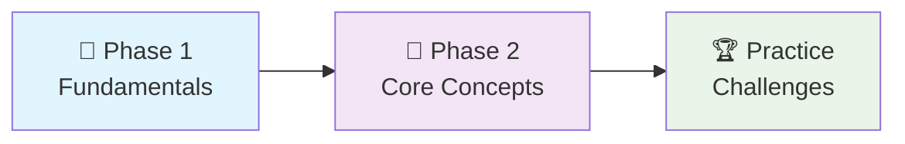
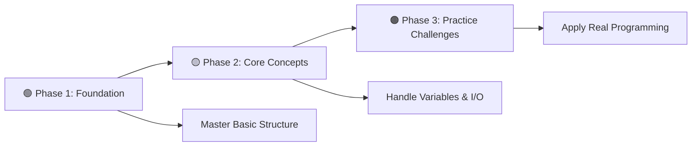

# 🚀 C Programming Fundamentals: Complete Learning Journey

<div align="center">


### Welcome to the **Basic Structure Of C** module of **CGenesis**! 🎯


*A comprehensive, structured journey through C programming fundamentals with hands-on practice and real-world applications*  

</div>

---

## 🌟 Why This Course?

This repository provides a **complete learning pathway** for C programming beginners. Unlike scattered tutorials, this course offers:

- 📚 **Structured Learning**: Progressive difficulty with clear milestones
- 💻 **Hands-On Practice**: 12 code files with detailed examples
- 🏆 **Challenge-Based**: 22+ practice problems to reinforce learning
- 📖 **Self-Paced**: Learn at your own speed with clear progress tracking
- 🎓 **Student-Tested**: Designed specifically for Class 10-12 students

---

## 📚 Table of Contents

- [🚀 Quick Start Guide](#-quick-start-guide)
- [🎯 Learning Path Overview](#-learning-path-overview)
- [📖 Learning Modules](#-learning-modules)
- [🏆 Practice Challenges](#-practice-challenges)
- [🎯 Recommended Learning Path](#-recommended-learning-path)
- [💻 Essential Code Examples](#-essential-code-examples)
- [🎓 What's Next?](#-whats-next)
- [🤝 Resources & Support](#-resources--support)

---

## ⚡ Quick Start Guide

### Prerequisites

- Any C compiler (GCC, Dev-C++, Code::Blocks)
- Text editor or IDE
- Enthusiasm to learn! 🔥

### Getting Started

```bash
# 1. Clone the repository
git clone https://github.com/rohit528590/CGenesis.git

# 2. Navigate to the project
cd CGenesis

# 3. Start with Phase 1
cd 01_Basics
Open 01_First.c and begin your journey!
```

### Your First Program

```c
#include <stdio.h>
int main() {
    printf("Hello, C Programming World!\n");
    return 0;
}
```

---

## 🎯 Learning Path Overview

<div align="center">



</div>

---

## 📖 Learning Modules

### Phase 1: Foundation Building 🌱

*Master the absolute basics of C programming structure and syntax*  

| # | 📁 **File** | 📊 **Difficulty** | 🔑 **Key Concepts** |
|---|------|-------------------|---------------------|
| 1 | [Our First Program](01_First.c) | ⭐ | 👋 Hello World, Program execution |
| 2 | [Boilerplate code](02_Boilerplate_code.c) | ⭐ | 📚 `#include`, `main()`, `return` |
| 3 | [Comments](03_Comments.c) | ⭐ | 💬 Single-line, Multi-line comments |
| 4 | [Escape Sequence](04_Escape_Sequence.c) | ⭐ | ⚡ `\n`, `\t`, Special characters |

**🎯 Phase 1 Milestone**: Write and execute basic C programs with proper formatting

---

### Phase 2: Core Programming Concepts 🔧

*Learn variables, data types, and fundamental operations*  

| # | 📁 **File** | 📊 **Difficulty** | 🔑 **Key Concepts** |
|---|------|-------------------|---------------------|
| 5 | [Variable Declaration](05_Variable_Declaration.c) | ⭐⭐ | 📦 Declaration, Initialization |
| 6 | [Variable naming rules](06_Variable_naming_rules.c) | ⭐⭐ | 📝 Best practices, Conventions |
| 7 | [Airthmetic(Moduls) Operator](07_Airthmetic(Moduls)_Operator.c) | ⭐⭐ | ➕ Math operations, Modulus |
| 8 | [Data Types](08_Data_Types.c) | ⭐⭐ | 🏷️ `int`, `float`, `char`, Specifiers |
| 9 | [Input Output](09_Input_Output.c) | ⭐⭐ | 🔄 `scanf()`, `printf()`, User input |
| 10 | [Hierarchy of operators](10_Hierarchy_of_operators.c) | ⭐⭐⭐ | 📊 Order of operations |
| 11 | [Type Casting](11_TypeCasting.c) | ⭐⭐⭐ | 🔄 Data conversion, Casting |
| 12 | [Size of Data Types](12_Size_of_Data_Types.c) | ⭐⭐⭐ | 📏 `sizeof()`, Memory allocation |

**🎯 Phase 2 Milestone**: Create interactive programs that process user input and perform calculations

---

## 🏆 Practice Challenges

### 📁 Challenge Categories - [Practice_Questions.txt](Practice_Questions.txt)

<details>
<summary>🟢 <strong>Level 1: Basic Operations</strong> (Complete after Phase 1)</summary>

Perfect for building confidence with simple input/output operations.

| Challenge | 📊 Skills |
|-----------|---------|
| Sum of two numbers | Variables, I/O |
| Calculate cube | Arithmetic operations |
| Square perimeter | Basic formulas |
| Rectangle area & perimeter | Multiple inputs |

**Goal**: Master basic programming structure and simple calculations

</details>

<details>
<summary>🟡 <strong>Level 2: Mathematical Applications</strong> (Complete after Phase 2)</summary>

Apply programming concepts to solve real-world mathematical problems.

| Challenge | 📊 Skills |
|-----------|---------|
| Circle area & circumference | Constants, Math formulas |
| Grade calculator | Multiple inputs, Percentages |
| Simple interest | Complex formulas, User interaction |
| Volume calculations | 3D geometry, Advanced math |

**Goal**: Combine multiple concepts to solve practical problems

</details>

<details>
<summary>🔴 <strong>Level 3: Advanced Problem Solving</strong> (Bonus Challenges)</summary>

Challenge yourself with complex logical problems and alternative approaches.

| Challenge | 📊 Skills |
|-----------|---------|
| Temperature converter (all units) | Multiple conversions, Logic |
| Remainder without modulus | Alternative algorithms |
| Precision handling | Float operations, Type casting |

**Goal**: Think creatively and develop problem-solving skills

</details>

---

## 🎯 **Recommended Learning Path**



**💡 Pro Tip**: Progress through each phase systematically - master program structure and syntax before diving into variables and calculations!

---

## 💻 Essential Code Examples

### 1. Essential C Structure

```c
#include <stdio.h>      // Include standard I/O library
int main() {            // Program entry point
    // Your code here
    return 0;           // Successful program termination
}
```

### 2. Input and Output

```c
int num;    
printf("Enter a number: ");
scanf("%d", &num);
printf("You entered: %d\n", num);
```

### 3. Variable Declaration and Initialization

```c
int a = 5;
float b = 3.14;
char c = 'A';
```

### 4. Type Casting

```c
int x = 10;
double y = (double)x / 3;
printf("%f\n", y); // Output: 3.333333
```

### 5. Arithmetic and Modulus Operators

```c
int sum = 7 + 3;
int mod = 7 % 3;
printf("Sum: %d, Modulus: %d\n", sum, mod);
```

### 6. Comments

```c
// This is a single-line comment
/* This is a
   multi-line comment */
```

### 7. Escape Sequences

```c
printf("Hello\nWorld\t2024\n");
```

---

## 📊 Quick Reference

### Format Specifiers

| Data Type | Specifier | Example | Output |
|-----------|-----------|---------|--------|
| `int` | `%d` | `printf("%d", 42);` | `42` |
| `float` | `%f` | `printf("%.2f", 3.14159);` | `3.14` |
| `char` | `%c` | `printf("%c", 'A');` | `A` |
| `string` | `%s` | `printf("%s", "Hello");` | `Hello` |

### Escape Sequences

| Sequence | Effect | Usage Example |
|----------|--------|---------------|
| `\n` | New line | `printf("Line 1\nLine 2");` |
| `\t` | Tab (8 spaces) | `printf("Name:\tJohn");` |
| `\"` | Double quote | `printf("Say \"Hello\"");` |
| `\\` | Backslash | `printf("Path: C:\\folder");` |

### Operator Precedence (High to Low)

1. `()` - Parentheses
2. `*`, `/`, `%` - Multiplication, Division, Modulus
3. `+`, `-` - Addition, Subtraction
4. `=` - Assignment

---

## 🎓 What's Next?

Ready to level up your C programming journey? Here's your personalized learning roadmap:

### 🚀 Immediate Next Challenge

- **[📚 Basic Practice Problems](../02_Basics_Practice_Problems)** - Master C fundamentals through 22 progressive coding challenges with detailed solutions and comprehensive explanations

### 🌟 Topics Awaiting You

- **Control Structures**: `if-else`, `switch` statements
- **Loops**: `for`, `while`, `do-while` loops
- **Pattern Design**: Master complex geometric patterns and visual algorithms using nested loops

---

## 🤝 Resources & Support

<div align="center">

| 📚 **Resource Type** | 🔗 **Access Point** | 📝 **Description** |
|---------------------|---------------------|-------------------|
| **📋 Practice Problems** | [Practice_Questions.txt](Practice_Questions.txt) | Additional challenges to reinforce learning |
| **🐛 Bug Reports & Questions** | [Open an Issue](https://github.com/rohit528590/CGenesis/issues) | Report bugs or ask technical questions |
| **💬 Community Support** | [GitHub Issues](https://github.com/rohit528590/CGenesis/issues) | Get help with coding problems and technical questions |
| **🤝 Contribute** | [Fork Repository](https://github.com/rohit528590/CGenesis/fork) | Help improve the course for everyone |

</div>

---

<div align="center">

## 🎉 **Ready to Start Your Programming Journey?**

**Follow the exact progression from your carefully crafted examples!**

[](08_Data_Types.c)
[](09_Input_Output.c)
[](Practice_Questions.txt)

### 🌟 **Remember:**

*Every expert programmer started exactly where you are now. The key is consistent practice and curiosity to learn!*

---

### 💪 Your Structured Learning Path

<div align="center">

```
🌱 Foundation Phase      🔧 Core Concepts      🏆 Practice Mastery
   (Files 1-4)            (Files 5-12)         (20+ Challenges)
       ↓                       ↓                      ↓
   Program Structure    Variables & I/O    Real-world Applications
```

**📈 Progressive Journey:** `Basic Syntax` → `Core Programming` → `Problem Solving Excellence`

</div>

---

### 🔗 **Support This Project**

[](https://github.com/rohit528590/CGenesis/stargazers)
[](https://github.com/rohit528590/CGenesis/network/members)

**⭐ [Star this Repository](https://github.com/rohit528590/CGenesis) to show your support!**

*Happy Coding, future programmer! 🚀👨‍💻👩‍💻*  

<sub>Built with ❤️ for C programming students | Based on proven learning progression | <a href="https://github.com/rohit528590/CGenesis">CGenesis Project</a></sub>
</div>
