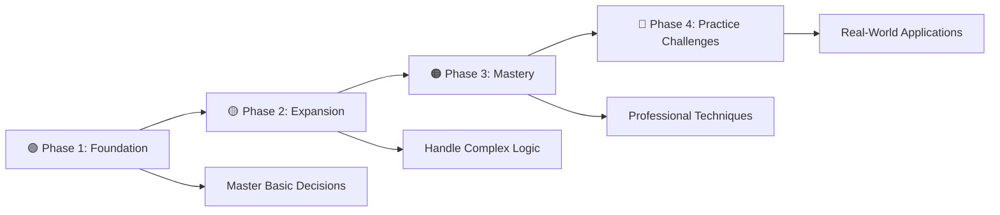

# 🚦 Conditionals & Decision Making in C Programming

<div align="center">

[](https://en.wikipedia.org/wiki/C_(programming_language))
[](https://github.com/rohit528590/CGenesis/03_If-Else)
[](https://github.com/rohit528590/CGenesis/03_If-Else)
[](https://github.com/rohit528590/CGenesis/tree/main/03_If-Else)

**Master the art of decision-making in C programming through hands-on examples and progressive challenges**  


</div>

---

## 🌟 Overview

Welcome to the **Conditionals & Decision Making** module of **CGenesis**! Master intelligent decision-making in C programming through practical examples and progressive challenges.

> **💡 Why Conditionals Matter:** Transform your programs from simple sequential code to intelligent applications that respond dynamically to different scenarios and user inputs.

### 🎯 What You'll Master

- ✅ **Decision Logic**: if, else if, else, and nested conditionals
- ✅ **Logical Operators**: &&, ||, ! for complex conditions  
- ✅ **Switch Statements**: Efficient multi-way branching
- ✅ **Conditional Expressions**: Ternary operators and optimization
- ✅ **Real Applications**: Build interactive programs and validation systems

---

## 📋 Table of Contents

- [🚀 Quick Start](#-quick-start)
- [🎓 Learning Path](#-learning-path)
- [🏆 Practice Challenges](#-practice-challenges)
- [🎯 Recommended Learning Path](#-recommended-learning-path)
- [💻 Code Examples](#-code-examples)
- [📖 Reference Guide](#-reference-guide)
- [🎯 What's Next?](#-whats-next)
- [🤝 Resources & Support](#-resources--support)

---

## 🚀 Quick Start

### 🎯 Prerequisites

- Basic understanding of C syntax
- GCC compiler or any C compiler
- Text editor or IDE (Code::Blocks, Dev-C++, VS Code)

### Compilation & Execution

```bash
# Clone the repository
git clone https://github.com/rohit528590/CGenesis.git
cd CGenesis/03_If-Else

# Compile any program
gcc filename.c -o output

# Run the program
./output

# Example with Problem 1
gcc 01_if_Condition.c -o if
./if
```

---

## 🎓 Learning Path

Our structured approach takes you from basic if-statements to advanced decision-making patterns:

### 📍 **Phase 1: Foundation** - Building Decision-Making Skills

*Master the fundamentals that every programmer needs*  

| # | 🎯 **Program** | 📊 **Difficulty** | 📚 **Core Concept** | 🔧 **Key Skills** |
|---|----------------|-------------------|---------------------|-------------------|
| 1 | **[if Condition](01_if_Condition.c)** | ⭐ | One-way decisions | Basic if statements, condition evaluation |
| 2 | **[if-else](02_if-else.c)** | ⭐ | Two-way branching | Binary decisions, else clause |
| 3 | **[if with 0 and 1](06_if_with_0_and_1.c)** | ⭐⭐ | Boolean logic in C | Truthiness, 0 vs non-zero values |

**🎯 Phase Goal:** Write programs that can make basic yes/no decisions

---

### 📍 **Phase 2: Expansion** - Complex Logic Systems

*Learn to handle multiple conditions and scenarios*  

| # | 🎯 **Program** | 📊 **Difficulty** | 📚 **Core Concept** | 🔧 **Key Skills** |
|---|----------------|-------------------|---------------------|-------------------|
| 4 | **[if-else_else-if](03_if_else-else-if.c)** | ⭐⭐ | Multi-way branching | Chained conditionals, priority handling |
| 5 | **[Logical Operators](04_Logical_operators.c)** | ⭐⭐⭐ | Compound conditions | AND, OR, NOT operations |
| 6 | **[Nested if](05_Nested-if.c)** | ⭐⭐⭐ | Layered decision making | Hierarchical logic, code organization |
| 7 | **[Switch Statements](07_Switch_statements.c)** | ⭐⭐ | Multi-case selection | Switch syntax, case handling, break statements |

**🎯 Phase Goal:** Build sophisticated decision trees and handle complex scenarios

---

### 📍 **Phase 3: Mastery** - Professional Techniques

*Write clean, efficient, and maintainable conditional code*  

| # | 🎯 **Program** | 📊 **Difficulty** | 📚 **Core Concept** | 🔧 **Key Skills** |
|---|----------------|-------------------|---------------------|-------------------|
| 8 | **[ternary if](08_ternary_if.c)** | ⭐⭐⭐ | Compact conditionals | Ternary operator, inline decisions |
| 9 | **[Practice Questions](Practice_Questions.txt)** | ⭐⭐⭐⭐ | Real-world applications | Problem-solving, optimization |

**🎯 Phase Goal:** Write professional-grade conditional code with optimal performance

---

## 🏆 [Practice Challenges](Practice_Questions.txt)

### 📁 **if-else Practice** - [Practice_Questions.txt](Practice_Questions.txt)

> **📈 Progress Tracking:** Complete challenges in order to build skills systematically.

<details>
<summary> 🌱 Level 1: Foundation (⭐)</summary>

*Perfect for building confidence with basic conditionals*  

| # | 🎯 **Challenge** | 📝 **Description** | 🎲 **Sample Input** | ✅ **Expected Output** |
|---|------------------|--------------------|--------------------|----------------------|
| 1 | Age Verification | Check driving eligibility (18+) | `Age: 17` | `❌ Not eligible for license` |
| 2 | Number Sign | Identify positive/negative/zero | `Number: -5` | `📍 Negative number` |
| 3 | Even or Odd | Classify number parity | `Number: 42` | `✅ Even number` |
| 4 | Password Strength | Check if password length ≥ 8 | `Password: hello` | `❌ Weak password (too short)` |
| 5 | Temperature Alert | Warn if temp > 35°C or < 0°C | `Temp: 38` | `🌡️ Heat warning!` |

</details>

<details>
<summary> 🚀 Level 2: Development (⭐⭐)</summary>

*Intermediate challenges with multiple conditions*  

| # | 🎯 **Challenge** | 📝 **Description** | 🧠 **Key Concepts** |
|---|------------------|--------------------|--------------------|
| 6 | Smart Grade Calculator | Assign grades with bonus points | if-else-if, range checking |
| 7 | Triangle Validator | Check if three sides form a valid triangle | Logical operators, mathematical rules |
| 8 | Leap Year Checker | Determine leap year using complex rules | Compound conditions, modulus |
| 9 | BMI Calculator | Calculate and categorize BMI | Nested conditions, health ranges |
| 10 | Login System | Multi-factor authentication checker | Complex logical operations |

</details>

<details>
<summary> 🎓 Level 3: Mastery (⭐⭐⭐)</summary>

*Advanced real-world problem solving*  

| # | 🎯 **Challenge** | 📝 **Description** | 🏆 **Advanced Skills** |
|---|------------------|--------------------|--------------------|
| 11 | Tax Calculator | Progressive tax calculation system | Multi-tier logic, financial algorithms |
| 12 | Academic Scholarship | Complex eligibility with multiple criteria | Nested conditions, weighted decisions |
| 13 | Smart Home System | IoT device control with priority logic | Switch statements, priority handling |
| 14 | Game Character Stats | RPG character validation and leveling | Complex validation, gaming logic |
| 15 | E-commerce Discount | Dynamic pricing with multiple discount tiers | Business logic, optimization |

</details>

---

## 🎯 **Recommended Learning Path**



**💡 Pro Tip**: Progress through each phase systematically - master simple if-statements before tackling nested conditions, then apply your skills with challenging practice problems!

---

## 💻 Code Examples

### 🔥 **1. Basic if Condition**

```c
int age = 18;
if (age >= 18) {
    printf("You can vote!\n");
}
```

### 🔥 **2. if-else Condition**

```c
int number = 15;
if (number % 2 == 0) {
    printf("Even\n");
} else {
    printf("Odd\n");
}
```

### 🔥 **3. if-else-if Ladder**

```c
int marks = 85;
if (marks >= 90) {
    printf("Grade A+\n");
} else if (marks >= 80) {
    printf("Grade A\n");
} else if (marks >= 70) {
    printf("Grade B\n");
} else {
    printf("Grade C\n");
}
```

### 🔥 **4. Comparison Operators**

```c
int a = 10, b = 20;
if (a == b) printf("Equal\n");           // ==
if (a != b) printf("Not equal\n");       // !=
if (a < b)  printf("Less than\n");       // <
if (a > b)  printf("Greater than\n");    // >
if (a <= b) printf("Less or equal\n");   // <=
if (a >= b) printf("Greater or equal\n"); // >=
```

### 🔥 **5. Logical Operators**

```c
int age = 25, salary = 50000;
// AND (&&) - All conditions must be true
if (age >= 21 && salary >= 30000) {
    printf("Loan approved\n");
}

// OR (||) - At least one condition must be true
if (age >= 60 || salary >= 100000) {
    printf("Premium member\n");
}

// NOT (!) - Reverses the condition
if (!(age < 18)) {
    printf("Adult\n");
}
```

### 🔥 **6. Nested if Statements**

```c
int temp = 25, sunny = 1;
if (temp >= 20) {
    if (sunny) {
        printf("Perfect weather!\n");
    } else {
        printf("Good weather\n");
    }
} else {
    printf("Cold weather\n");
}
```

### 🔥 **7. Ternary Operator**

```c
int a = 15, b = 20;
int max = (a > b) ? a : b;  // Compact if-else
printf("Max: %d\n", max);

// Multiple ternary
int age = 17;
char* type = (age < 13) ? "child" : (age < 20) ? "teen" : "adult";
printf("Type: %s\n", type);
```

---

## 📖 Reference Guide

### 🔍 **Comparison Operators**

| Operator | Description | Example | Result |
|----------|-------------|---------|---------|
| `==` | Equal to | `5 == 5` | True (1) |
| `!=` | Not equal to | `5 != 3` | True (1) |
| `>` | Greater than | `7 > 3` | True (1) |
| `<` | Less than | `3 < 7` | True (1) |
| `>=` | Greater than or equal | `5 >= 5` | True (1) |
| `<=` | Less than or equal | `3 <= 7` | True (1) |

### 🧮 **Logical Operators**

| Operator | Name | Description | Example | When True |
|----------|------|-------------|---------|-----------|
| `&&` | AND | Both conditions must be true | `(a > 5) && (b < 10)` | Both conditions are true |
| `\|\|` | OR | At least one condition must be true | `(a == 5) \|\| (b == 10)` | Either condition is true |
| `!` | NOT | Reverses the condition | `!(a > 5)` | Original condition is false |

---

## 🎯 What's Next?

Ready to level up your C programming journey? Here's your personalized learning roadmap:

### 🚀 Immediate Next Challenge

- **[📚 If-Else Practice Problems](../04_If-Else_Practice_Problems)** - Master C if-else through 22 progressive coding challenges with detailed solutions and comprehensive explanations

### 🌟 Topics Awaiting You

- **Loops**: `for`, `while`, `do-while` loops
- **Patterns**: Creating patterns using loops
- **Functions**: Reusable code blocks
- **Recursion**: Solving problems using self-referential logic

---

## 🤝 Resources & Support

<div align="center">

| 📚 **Resource Type** | 🔗 **Access Point** | 📝 **Description** |
|---------------------|---------------------|-------------------|
| **🧠 If-Else Practice Problems** | [Practice_Questions.txt](Practice_Questions.txt) | 20+ real-world conditional logic challenges to master decision making |
| **🐛 Bug Reports & Questions** | [Open an Issue](https://github.com/rohit528590/CGenesis/issues) | Report bugs or ask technical questions |
| **💬 Community Support** | [GitHub Issues](https://github.com/rohit528590/CGenesis/issues) | Get help with coding problems and technical questions |
| **🤝 Contribute** | [Fork Repository](https://github.com/rohit528590/CGenesis/fork) | Help improve the course for everyone |

</div>

---

<div align="center">

## 🚀 Ready to Master C If-Else?

**Follow the exact progression from your carefully crafted examples!**

[](01_if_Condition.c)
[](03_if_else-else-if.c)
[](Practice_Questions.txt)

### 🌟 **Remember:**

*Every expert programmer started exactly where you are now. The key is consistent practice and curiosity to learn!*

---

### 💪 Your Structured Learning Path

<div align="center">

```
🌱 Foundation Phase      🔧 Core Concepts      🏆 Practice Mastery
   (11 Core Files)       (Decision Logic)     (50+ If-Else Problems)
       ↓                       ↓                      ↓
   Basic Conditionals    Complex Logic Flow    Real-world Applications
```

**📈 Progressive Journey:** `Simple If-Else` → `Advanced Conditionals` → `If-Else Mastery Excellence`

</div>

---

### 🔗 **Support This Project**

[](https://github.com/rohit528590/CGenesis/stargazers)
[](https://github.com/rohit528590/CGenesis/network/members)

**⭐ [Star this Repository](https://github.com/rohit528590/CGenesis) to show your support!**

*Happy Coding, future programmer! 🚀👨‍💻👩‍💻*  

<sub>Built with ❤️ for C programming students | Based on proven learning progression | <a href="https://github.com/rohit528590/CGenesis">CGenesis Project</a></sub>
</div>
