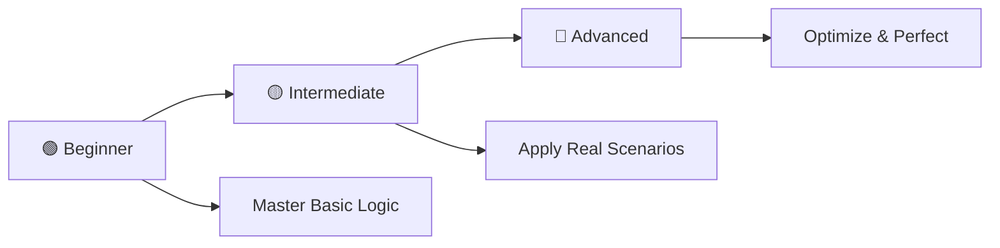

# 🧩 If-Else Practice Problems in C

<div align="center">

[](https://en.wikipedia.org/wiki/C_(programming_language))
[](https://github.com/rohit528590/CGenesis/04_If-Else_Practice_Problems)
[](https://github.com/rohit528590/CGenesis/04_If-Else_Practice_Problems)
[](https://github.com/rohit528590/CGenesis/04_If-Else_Practice_Problems)
[](https://github.com/rohit528590/CGenesis/tree/main/04_If-Else_Practice_Problems)

### Welcome to the **If-Else Practice Problems** module of **CGenesis**! 🎯


*Master conditional programming through hands-on challenges, real-world decision-making scenarios, and comprehensive step-by-step solutions.*

</div>

---

## 📋 Table of Contents

- [🎯 Learning Objectives](#-learning-objectives)
- [⚡ Quick Start Guide](#-quick-start-guide)
- [📚 Problem Categories](#-problem-categories)
- [🎯 Recommended Learning Path](#-recommended-learning-path)
- [💻 Essential Code Examples](#-essential-code-examples)
- [🎓 What's Next?](#-whats-next)
- [🤝 Resources & Support](#-resources--support)

---

## 🎯 Learning Objectives

By completing these practice problems, you will:

- ✅ **Master Conditional Logic**: Gain proficiency with `if`, `else if`, `else`, and logical operators.
- ✅ **Develop Problem-Solving Skills**: Learn to break complex problems into manageable steps.
- ✅ **Build Programming Confidence**: Practice with real-world scenarios and edge cases.
- ✅ **Think Like a Developer**: Develop logical reasoning and algorithmic thinking.

---

## ⚡ Quick Start Guide

### Prerequisites

- Any C compiler (GCC, Dev-C++, Code::Blocks)
- Text editor or IDE
- Enthusiasm to learn! 🔥

### Getting Started

```bash
# Clone the repository
git clone https://github.com/rohit528590/CGenesis.git

# Change directory
cd CGenesis/04_If-Else_Practice_Problems

# Compile any program
gcc filename.c -o output

# Run the program
./output

# Example with Problem 1
gcc 01_License_or_not.c -o license
./license
```

---

## 📚 Problem Categories

### 🟢 Beginner Level - Foundation Building (13 Problems)

*Perfect for building confidence with basic conditional statements*  

| # | 🎯 **Challenge** | 📊 **Difficulty** | 🔑 **Key Concepts** |
|---|------------------|-------------------|---------------------|
| 01 | [License or Not](01_License_or_not.c) | ⭐ | 🆔 Simple if-else conditions |
| 02 | [Three Digits Check](02_Three_Digits_or_not.c) | ⭐ | 🔢 Boundary conditions |
| 03 | [Absolute Value](03_Absolute_value.c) | ⭐ | ➕ Positive/negative checks |
| 04 | [Average Calculator](04_Average_of_three_numbers.c) | ⭐ | 📊 Basic calculations with conditions |
| 05 | [Area vs Perimeter](05_Area_vs_perimeter_rectangle.c) | ⭐⭐ | 📐 Formula-based conditionals |
| 06 | [Character Digit Check](06_Character_digit_or_not.c) | ⭐⭐ | 🔤 ASCII value checking |
| 07 | [Lowercase Detector](07_Character_lowercase_or_not.c) | ⭐⭐ | 🔠 Case sensitivity |
| 08 | [Even or Odd](08_Even_or_Odd.c) | ⭐ | ⚖️ Basic divisibility |

**🎯 Skills Gained:** Basic conditionals, logical operators, simple decision making

### 🟡 Intermediate Level - Skill Enhancement (8 Problems)

*Develop more sophisticated conditional reasoning and real-world problem solving*  

| # | 🎯 **Challenge** | 📊 **Difficulty** | 🔑 **Key Concepts** |
|---|------------------|-------------------|---------------------|
| 09 | [Divisibility Checker](09_Dividend_divisible_by_divisor.c) | ⭐⭐ | ➗ Remainder operations |
| 10 | [Divisible by 5](10_Divisible_by_5.c) | ⭐ | 5️⃣ Specific number patterns |
| 11 | [Divisible by 5 AND 3](11_Divisible_by_5_and_3.c) | ⭐⭐ | 🔗 Multiple conditions |
| 12 | [Complex Divisibility](12_Divisible_by_5_or_3_not_15.c) | ⭐⭐⭐ | 🚫 Exclusion patterns |
| 13 | [Logical Operators Lab](13_Logical_operators_practice.c) | ⭐⭐ | 🧠 &&, \|\|, ! operators |
| 14 | [Profit or Loss Calculator](14_Profit_or_loss.c) | ⭐⭐ | 💰 Financial calculations |
| 15 | [Triangle Validator](15_Triangle_validation.c) | ⭐⭐⭐ | 📐 Triangle inequality theorem |
| 16 | [Leap Year Checker](16_Leap_year_checker.c) | ⭐⭐⭐ | 📅 Complex date rules |

**🎯 Skills Gained:** Complex conditionals, nested logic, real-world applications

### 🔴 Advanced Level - Mastery Challenges (3 Problems)

*Polish your skills with complex scenarios and algorithmic thinking*  

| # | 🎯 **Challenge** | 📊 **Difficulty** | 🔑 **Key Concepts** |
|---|------------------|-------------------|---------------------|
| 17 | [Smart Grade System](17_Grade_system.c) | ⭐⭐⭐ | 🎓 Multi-level decision making |
| 18 | [Greatest of Three](18_Greatest_of_three.c) | ⭐⭐ | 🏆 Multiple variable comparison |
| 19 | [Tax Calculator](19_Tax_calculation.c) | ⭐⭐⭐ | 🏦 Progressive calculations |
| 20 | [Pass/Fail System](20_Pass_fail_system.c) | ⭐⭐⭐ | ✅ Multi-criteria evaluation |
| 21 | [Age Comparator](21_Age_comparison.c) | ⭐⭐ | 👴 Relative comparisons |
| 22 | [Minimum Finder](22_Min_finder.c) | ⭐⭐⭐ | ⬇️ Efficient comparisons |
| 23 | [Maximum Finder](23_Max_finder.c) | ⭐⭐⭐ | ⬆️ Advanced comparison techniques |
| 24 | [MinMax Algorithm](24_MinMax_algorithm.c) | ⭐⭐⭐⭐ | ⚡ Simultaneous min/max finding |

**🎯 Skills Gained:** Algorithm optimization, efficient coding patterns, advanced problem solving

---

### 🎯 **Recommended Learning Path**



**💡 Pro Tip**: Complete problems in sequence for optimal skill building!

---

## 💻 Essential Code Examples

Get familiar with common conditional patterns through these bite-sized examples:

### 🔍 **Basic Comparisons**

```c
// Find minimum of two numbers
int a = 5, b = 8;
printf("Minimum: %d\n", (a < b) ? a : b);
```

### 🧮 **Complex Logical Conditions**

```c
// Check divisibility by 5 or 3 but not 15
int n = 30;
if (((n % 5 == 0) || (n % 3 == 0)) && (n % 15 != 0)) {
    printf("Condition satisfied\n");
} else {
    printf("Condition not satisfied\n");
}
```

### 📊 **Multi-Level Grading**

```c
// Grade assignment system
int marks = 85;
if (marks >= 90)      printf("Grade: A+\n");
else if (marks >= 80) printf("Grade: A\n");
else if (marks >= 70) printf("Grade: B\n");
else if (marks >= 60) printf("Grade: C\n");
else                  printf("Grade: F\n");
```

### 📅 **Date Calculations**

```c
// Leap year validation
int year = 2024;
if ((year % 4 == 0 && year % 100 != 0) || (year % 400 == 0)) {
    printf("%d is a leap year\n", year);
} else {
    printf("%d is not a leap year\n", year);
}
```

### 💰 **Business Logic**

```c
// Profit/Loss calculation
int cost_price = 100, selling_price = 120;
int difference = selling_price - cost_price;

if (difference > 0)      printf("Profit: $%d\n", difference);
else if (difference < 0) printf("Loss: $%d\n", -difference);
else                     printf("Break-even (No profit, no loss)\n");
```

---

## 🎓 What's Next?

Ready to level up your C programming journey? Here's your personalized learning roadmap:

### 🚀 Immediate Next Challenge

- **[🔄 Loops & Iteration](../05_Loops)** - Master loop control structures, nested patterns, and iterative algorithms through comprehensive examples and 50+ practice challenges

### 🌟 Topics Awaiting You

- **🎨 Pattern Generation** - Create geometric patterns, ASCII art, and algorithmic designs using advanced loop techniques

- **⚙️ Functions & Modularity** - Build reusable functions with parameter passing, return optimization, and modular programming principles

- **🔄 Recursive Algorithms** - Implement recursive problem-solving techniques, stack optimization, and divide-and-conquer strategies

---

## 🤝 Resources & Support

<div align="center">

| 📚 **Resource Type** | 🔗 **Access Point** | 📝 **Description** |
|---------------------|---------------------|-------------------|
| **🐛 Bug Reports & Questions** | [Open an Issue](https://github.com/rohit528590/CGenesis/issues) | Report bugs or ask technical questions |
| **💬 Community Support** | [GitHub Issues](https://github.com/rohit528590/CGenesis/issues) | Get help with coding problems and technical questions |
| **🤝 Contribute** | [Fork Repository](https://github.com/rohit528590/CGenesis/fork) | Help improve the course for everyone |

</div>

---

<div align="center">

### 🌟 Ready to Master Conditional Logic?

**Choose your starting point and begin your coding journey!**

[](01_License_or_not.c)
[](09_Dividend_divisible_By_Divisor_or_not.c)
[](17_Grade_according_to_marks.c)

---

### 💪 Your Structured Learning Path

<div align="center">

```
🟢 Foundation Level      🟡 Intermediate Level      🟠 Advanced Level
   (Problems 1-8)          (Problems 9-16)           (Problems 17-24)
       ↓                        ↓                         ↓
   Basic Logic & Conditions    Real-World Scenarios    Algorithm Mastery
```

**📈 Structured Path:** `Foundation Mastery` → `Real-World Proficiency` → `Advanced Applications`

</div>

---


### 🔗 **Support This Project**

<div align="center">

[](https://github.com/rohit528590/CGenesis/stargazers)
[](https://github.com/rohit528590/CGenesis/network/members)

**⭐ [Star this Repository](https://github.com/rohit528590/CGenesis) to show your support!**

</div>

*Happy Coding, future programmer! 🚀👨‍💻👩‍💻*  

</div>

<div align="center">
<sub>Built with ❤️ for C programming students | Based on proven learning progression | <a href="https://github.com/rohit528590/CGenesis">CGenesis Project</a></sub>
</div>
