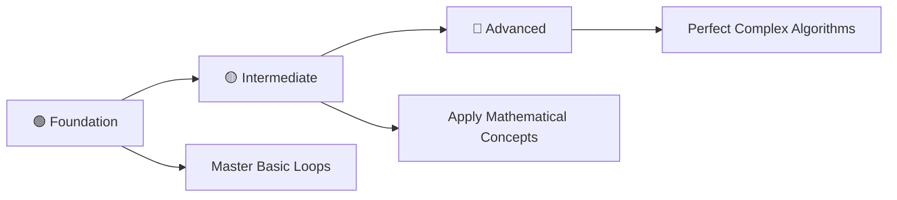

# 🔥 Loop Mastery: Complete C Programming Challenge

> **Master Loops Through 41 Progressive Programming Problems**

<div align="center">

[](https://en.wikipedia.org/wiki/C_(programming_language))
[](https://github.com/rohit528590/CGenesis/06_Iterative_Statements_Practice_Problems)
[](https://github.com/rohit528590/CGenesis/tree/main/06_Iterative_Statements_Practice_Problems)
[](https://github.com/rohit528590/CGenesis/tree/main/06_Iterative_Statements_Practice_Problems)
[](https://github.com/rohit528590/CGenesis/tree/main/06_Iterative_Statements_Practice_Problems)

### Welcome to the **Loops Practice Problems** module of **CGenesis**! 🎯


*Master loops through **41 progressive challenges** covering fundamental concepts to advanced algorithms with real-world applications.*

</div>

---

## 📋 Table of Contents

- [📖 Overview](#-overview)
- [⚡ Quick Start Guide](#-quick-start-guide)
- [📚 Problem Categories](#-problem-categories)
- [🎯 Recommended Learning Path](#-recommended-learning-path)
- [🔄 Iterative Examples](#-iterative-examples)
- [🎓 What's Next?](#-whats-next)
- [🤝 Resources & Support](#-resources--support)

---

## 📖 Overview

This repository contains **41 carefully crafted C programming problems** focused exclusively on loops and iteration. Each problem builds upon previous concepts while introducing new challenges, perfect for mastering control structures and algorithmic thinking.

### 🎯 Learning Objectives

- **🔄 Master Loop Fundamentals**: for, while, and do-while structures
- **🧠 Develop Algorithmic Thinking**: Decompose problems into iterative solutions
- **📊 Practice Mathematical Programming**: Arithmetic sequences to number theory
- **🌍 Real-World Problem Solving**: Professional programming scenarios
- **🔀 Multiple Solution Approaches**: Compare loop types and optimizations
- **💡 Strengthen Analytical Skills**: Logic, patterns, and debugging

---

## ⚡ Quick Start Guide

### Prerequisites

- Any C compiler (GCC, Dev-C++, Code::Blocks)
- Text editor or IDE
- Enthusiasm to learn! 🔥

### Getting Started

```bash
# Clone the repository
git clone https://github.com/rohit528590/CGenesis.git

# Change directory
cd CGenesis/06_Iterative_Statements_Practice_Problems

# Compile any program
gcc filename.c -o output

# Run the program
./output

# Example with Problem 1
gcc 01_hello_world_n_times.c -o hello_world
./hello_world
```

---

## 📚 Problem Categories

#### 📝 Problem List - [Loops Practice Problems](00_Practice_Problems_Based_on_Iterative_Statements.txt)

### 🟢 **Foundation Level** (Problems 1-13)

*Build your loop fundamentals with essential concepts*  

| # | 📁 **Problem Title** | 📊 **Difficulty** | 🔑 **Key Concepts** |
|---|---------|-------------------|--------------------------------------|
| 01 | [Hello World N Times](01_hello_world_n_times.c) | ⭐ | 🔄 Basic for loops, iteration control |
| 02 | [Print Numbers in Range](02_print_numbers_in_range.c) | ⭐ | 📍 Range iteration, loop boundaries |
| 03 | [Natural Numbers Skip Range](03_natural_numbers_skip_range.c) | ⭐⭐ | ❌ Conditional loops, skip logic |
| 04 | [Odd Numbers in Range](04_print_odd_numbers_range.c) | ⭐⭐ | 🔢 Number filtering, modulo operations |
| 05 | [Odd Numbers with Continue](05_odd_numbers_continue_statement.c) | ⭐⭐ | ⏩ Continue statement, flow control |
| 06 | [Multiplication Table](06_multiplication_table_n.c) | ⭐⭐ | ✖️ Mathematical loops, table generation |
| 07 | [Reverse Multiplication Table](07_reverse_multiplication_table.c) | ⭐⭐ | 🔄 Reverse iteration, decrementing loops |
| 08 | [Table Sum Products](08_table_sum_products.c) | ⭐⭐ | ➕ Accumulation patterns, running totals |
| 09 | [Sum Range For Loop](09_sum_range_while_loop.c) | ⭐⭐ | 🔄 For loop mastery, range summation |
| 10 | [Sum Range While Loop](10_sum_numbers_range_while.c) | ⭐⭐ | 📍 While loop implementation, comparison |
| 11 | [Even Numbers in Range](11_print_even_numbers_range.c) | ⭐⭐ | 🎯 Even number filtering, conditional logic |
| 12 | [ASCII Values Characters](12_ascii_values_characters.c) | ⭐⭐ | 🔤 Character processing, ASCII manipulation |
| 13 | [ASCII Values Characters While](13_ascii_values_characters_while.c) | ⭐⭐ | 🔀 While loop variant, loop comparison |

**Learning Goals**: Master basic loop syntax, understand different loop types, and practice simple iterations.

### 🟡 **Intermediate Level** (Problems 14-29)

*Develop analytical thinking and optimization skills*  

| # | 📁 **Problem Title** | 📊 **Difficulty** | 🔑 **Key Concepts** |
|---|---------|-------------------|--------------------------------------|
| 14 | [Factorial Given Number](14_factorial_given_number.c) | ⭐⭐ | ❗ Factorial algorithms, multiplicative loops |
| 15 | [Factorial All Range](15_factorial_all_range.c) | ⭐⭐ | 📊 Range processing, nested operations |
| 16 | [Nth Fibonacci Term](16_nth_fibonacci_term.c) | ⭐⭐⭐ | 🌀 Fibonacci sequences, iterative algorithms |
| 17 | [Fibonacci Series N Terms](17_fibonacci_series_n_terms.c) | ⭐⭐⭐ | 📈 Complete sequence generation, series output |
| 18 | [Arithmetic Progression 1,3,5](18_arithmetic_progression_1,3,5.c) | ⭐⭐ | ➕ Arithmetic progressions, linear sequences |
| 19 | [Arithmetic Progression 4,7,10,13](19_arithmetic_progression_4,7,10,13.c) | ⭐⭐ | 🔢 Custom arithmetic patterns, step calculations |
| 20 | [Geometric Progression 1,2,4,8,16](20_geometric_progression_1,2,4,8,16.c) | ⭐⭐⭐ | ✖️ Geometric progressions, exponential growth |
| 21 | [Geometric Progression 3,12,48](21_geometric_progression_3,12,48.c) | ⭐⭐⭐ | 📍 Custom geometric patterns, ratio calculations |
| 22 | [Geometric Progression 100,50,25](22_geometric_progression_100,50,25.c) | ⭐⭐ | ⬇️ Decreasing geometric series, division patterns |
| 23 | [Arithmetic Progression 100,97,94](23_arithmetic_progression_100,97,94.c) | ⭐⭐⭐ | ✅ Conditional termination, positive constraints |
| 24 | [Power Calculation](24_power_calculation.c) | ⭐⭐ | ⚡ Exponentiation algorithms, iterative multiplication |
| 25 | [Prime Composite Check](25_prime_composite_check.c) | ⭐⭐⭐ | 🔍 Prime number detection, divisibility testing |
| 26 | [Prime Check While Loop](26_prime_check_while_loop.c) | ⭐⭐⭐ | 🔄 Alternative prime checking, while implementation |
| 27 | [Prime Numbers Range](27_prime_numbers_range.c) | ⭐⭐⭐⭐ | 🎯 Prime generation algorithms, range filtering |
| 28 | [Alternating Series Sum](28_alternating_series_sum.c) | ⭐⭐⭐ | ➖ Alternating sign series, pattern recognition |
| 29 | [Negative Alternating Series](29_negative_alternating_series.c) | ⭐⭐⭐ | 🔄 Pattern variations, sign manipulation |

**Learning Goals**: Master complex mathematical operations, understand algorithmic efficiency, and develop problem-solving strategies.

### 🔴 **Advanced Level** (Problems 30-41)

*Tackle sophisticated loop applications and algorithms*  

| # | 🎯 **Problem Title** | 📊 **Difficulty** | 🔑 **Key Concepts** |
|---|------------------|-------------------|--------------------------------------|
| 30 | [Count Digits Number](30_count_digits_number.c) | ⭐⭐⭐ | 🔢 Digit processing, number decomposition |
| 31 | [Reverse Given Number](31_reverse_given_number.c) | ⭐⭐⭐ | 🔄 Number manipulation, digit extraction |
| 32 | [Sum Digits Number](32_sum_digits_number.c) | ⭐⭐⭐⭐ | 📍 Complex range validation, multiple conditions |
| 33 | [Sum Even Digits](33_sum_even_digits.c) | ⭐⭐⭐ | ➕ Digit summation, mathematical operations |
| 34 | [Sum Odd Digits](34_sum_odd_digits.c) | ⭐⭐⭐ | 🎯 Conditional digit operations, filtering |
| 35 | [Sum Digits Plus Reverse](35_sum_digits_plus_reverse.c) | ⭐⭐⭐ | 🔢 Selective digit processing, modulo usage |
| 36 | [Sum Number and Reverse](36_sum_number_and_reverse.c) | ⭐⭐⭐⭐ | 🔄 Multi-step algorithms, complex operations |
| 37 | [Input Until Odd](37_input_until_odd.c) | ⭐⭐⭐⭐ | ➕ Advanced number operations, combination logic |
| 38 | [Input Until Multiple Seven](38_input_until_multiple_seven.c) | ⭐⭐⭐ | ⌨️ Dynamic input termination, user interaction |
| 39 | [Palindrome Number Check](39_palindrome_number_check.c) | ⭐⭐⭐ | ✅ Custom validation loops, condition checking |
| 40 | [Armstrong Number Check](40_armstrong_number_check.c) | ⭐⭐⭐⭐ | 🪞 Symmetry detection, number comparison |
| 41 | [Armstrong Numbers Range](41_armstrong_numbers_range.c) | ⭐⭐⭐⭐ | 🎯 Special number properties, power calculations |

**Learning Goals**: Master advanced number theory, implement complex algorithms, and develop expertise in sophisticated loop applications.

---

### 🎯 **Recommended Learning Path**



**💡 Pro Tip**: Complete problems in sequence for optimal skill building!

---

## 🔄 Iterative Examples

### 1. Print Numbers in a Range

```c
int r = 1, s = 10;
for (int i = r; i <= s; i++) {
    printf("%d ", i);
}
```

### 2. Sum in a Range (While Loop)

```c
int r = 1, s = 5, sum = 0;
while (r <= s) {
    sum += r;
    r++;
}
printf("Sum: %d\n", sum);
```

### 3. Factorial of N

```c
int n = 5, fact = 1;
for (int i = 1; i <= n; i++) {
    fact *= i;
}
printf("Factorial: %d\n", fact);
```

### 4. Prime Check

```c
int n = 7, isPrime = 1;
for (int i = 2; i < n; i++) {
    if (n % i == 0) {
        isPrime = 0;
        break;
    }
}
printf(isPrime ? "Prime\n" : "Not Prime\n");
```

### 5. Input Until Condition (Multiple of 7)

```c
int num;
do {
    printf("Enter a number: ");
    scanf("%d", &num);
} while (num % 7 != 0);
printf("You entered a multiple of 7!\n");
```

---

## 🎓 What's Next?

Ready to level up your C programming journey? Here's your personalized learning roadmap:

### 🚀 Immediate Next Challenge

- **[🎨 Pattern Printing Practice Problems](../07_Pattern_Printing_Practice_Problems)** - Create stunning geometric patterns with 33 expert-level challenges from basic shapes to complex symmetric designs

### 🌟 Topics Awaiting You

- **Functions**: Creating functions using loops
- **Recursion**: Creating recursive functions using loops
- **Data Structures**: Array, 2D Array

---

## 🤝 Resources & Support

<div align="center">

| 📚 **Resource Type** | 🔗 **Access Point** | 📝 **Description** |
|---------------------|---------------------|-------------------|
| **🛠 Bug Reports & Questions** | [Open an Issue](https://github.com/rohit528590/CGenesis/issues) | Report bugs or ask technical questions |
| **💬 Community Support** | [GitHub Issues](https://github.com/rohit528590/CGenesis/issues) | Get help with coding problems and technical questions |
| **🤝 Contribute** | [Fork Repository](https://github.com/rohit528590/CGenesis/fork) | Help improve the course for everyone |

</div>

---

<div align="center">

### 🌟 Ready to Master Loops?

**Choose your starting point and begin your coding journey!**

[](01_hello_world_n_times.c)
[](14_factorial_given_number.c)
[](30_count_digits_number.c)

---

### 💪 Your Structured Learning Path

<div align="center">

```
🟢 Foundation Level      🟡 Intermediate Level      🟠 Advanced Level
   (Problems 1-13)          (Problems 14-29)           (Problems 30-41)
       ↓                        ↓                         ↓
   Basic Loops    Real-World Scenarios    Algorithm Mastery
```

**📈 Structured Path:** `Foundation Mastery` → `Real-World Proficiency` → `Advanced Applications`

</div>

---

### 🔗 **Support This Project**

<div align="center">

[](https://github.com/rohit528590/CGenesis/stargazers)
[](https://github.com/rohit528590/CGenesis/network/members)

**⭐ [Star this Repository](https://github.com/rohit528590/CGenesis) to show your support!**

</div>

*Happy Coding, future programmer! 🚀👨‍💻👩‍💻*  

</div>

<div align="center">
<sub>Built with ❤️ for C programming students | Based on proven learning progression | <a href="https://github.com/rohit528590/CGenesis">CGenesis Project</a></sub>
</div>
