# 🔥 Pattern Printing Mastery: Complete C Programming Challenge

> **Master Pattern Programming Through 33 Progressive Problems**

<div align="center">

[](https://en.wikipedia.org/wiki/C_(programming_language))
[](https://github.com/RohitSoni906068/CGenesis/tree/main/07_Pattern_Printing_Practice_Problems)
[](https://github.com/RohitSoni906068/CGenesis/tree/main/07_Pattern_Printing_Practice_Problems)
[](https://github.com/RohitSoni906068/CGenesis/tree/main/07_Pattern_Printing_Practice_Problems)
[](https://github.com/RohitSoni906068/CGenesis/tree/main/07_Pattern_Printing_Practice_Problems)

### Welcome to the **Pattern Printing Practice Problems** module of **CGenesis**! 🎯


*Master pattern printing through **33 progressive challenges** covering fundamental concepts to advanced algorithms with real-world applications.*

</div>

---

## 📋 Table of Contents

- [📖 Overview](#-overview)
- [🚀 Quick Start](#-quick-start)
- [📚 Problem Categories](#-problem-categories)
- [📯 Recommended Learning Path](#-recommended-learning-path)
- [🎨 Visual Pattern Showcase](#-visual-pattern-showcase)
- [🎓 What's Next?](#-whats-next)
- [🤝 Resources & Support](#-resources--support)

---

## 📖 Overview

Master **33 progressive pattern printing challenges** in C programming. From basic rectangles to complex diamonds, each problem builds essential skills in nested loops, algorithmic thinking, and geometric visualization.

### 🎯 Learning Objectives

- **🔄 Master Nested Loops**: Complex loop structures and control flow
- **🎨 Pattern Recognition**: Geometric shapes and symmetrical designs  
- **🧠 Algorithmic Thinking**: Problem decomposition and logical reasoning
- **💼 Interview Preparation**: Common technical interview patterns
- **⚡ Progressive Mastery**: Beginner-friendly to expert-level challenges

---

## 🚀 Quick Start

### Prerequisites

- Any C compiler (GCC, Dev-C++, Code::Blocks)
- Text editor or IDE
- Enthusiasm to learn! 🔥

### Getting Started

```bash
# Clone the repository
git clone https://github.com/RohitSoni906068/CGenesis.git

# Change directory
cd CGenesis/07_Pattern_Printing_Practice_Problems

# Compile any program
gcc filename.c -o output

# Run the program
./output

# Example with Problem 1
gcc 01_rectangle_asterisk_pattern.c -o rectangle_pattern
./rectangle_pattern
```

---

## 📚 Problem Categories

#### 📝 Problem List - [Pattern Printing Practice Problems](00_Practice_Problem_Based_on_Pattern_Printing.txt)

### 🟢 **Foundation Level** (Problems 1-11)

*Master the basics of pattern printing*  

| # | 📁 **Problem** | 📊 **Difficulty** | 🔑 **Key Concepts** |
|---|---------|-------------------|--------------------------------------|
| 01 | [Rectangle Asterisk Pattern](01_rectangle_asterisk_pattern.c) | ⭐ | 🔄 Nested loops and basic shapes |
| 02 | [Square Star Pattern](02_square_star_pattern.c) | ⭐ | 🔲 Equal dimensions and square logic |
| 03 | [Square Number Pattern](03_square_number_pattern.c) | ⭐⭐ | 🔢 Number patterns and data integration |
| 04 | [Left Triangle Asterisk Pattern](04_left_triangle_asterisk_pattern.c) | ⭐⭐ | 🔺 Variable bounds and triangular shapes |
| 05 | [Left Inverted Triangle Pattern](05_left_inverted_triangle_pattern.c) | ⭐⭐ | 🔻 Reverse logic and decreasing patterns |
| 06 | [Left Triangle Number Pattern](06_left_triangle_number_pattern.c) | ⭐⭐ | 🔢 Numeric sequences and triangles |
| 07 | [Left Inverted Number Triangle](07_left_inverted_number_triangle.c) | ⭐⭐ | 🔄 Backward counting and reverse order |
| 08 | [Left Triangle Odd Numbers](08_left_triangle_odd_numbers.c) | ⭐⭐⭐ | 🧮 Arithmetic progressions and odd sequences |
| 09 | [Square Alphabet Pattern](09_square_alphabet_pattern.c) | ⭐⭐ | 🔤 Character patterns and ASCII values |
| 10 | [Left Triangle Alphabet Pattern](10_left_triangle_alphabet_pattern.c) | ⭐⭐ | 🔠 Letter sequences and character incrementing |
| 11 | [Alternating Numeric Alpha Triangle](11_alternating_numeric_alpha_triangle.c) | ⭐⭐⭐ | 🎯 Combined patterns and multiple data types |

**Learning Goals**: Understand basic loop structures, pattern logic, and simple shape creation.

### 🟡 **Intermediate Level** (Problems 12-23)

*Develop advanced pattern recognition and complex algorithms*  

| # | 📁 **Problem** | 📊 **Difficulty** | 🔑 **Key Concepts** |
|---|---------|-------------------|--------------------------------------|
| 12 | [Plus Sign Pattern](12_plus_sign_pattern.c) | ⭐⭐⭐ | ➕ Cross patterns and conditional positioning |
| 13 | [Hollow Rectangle Pattern](13_hollow_rectangle_pattern.c) | ⭐⭐⭐ | 🕳️ Hollow shapes and border printing |
| 14 | [X Pattern Stars](14_x_pattern_stars.c) | ⭐⭐⭐ | ❌ Cross patterns and diagonal logic |
| 15 | [Floyds Triangle Numbers](15_floyds_triangle_numbers.c) | ⭐⭐⭐ | 🔢 Sequential numbering and continuous counting |
| 16 | [Floyds Triangle Odd Numbers](16_floyds_triangle_odd_numbers.c) | ⭐⭐⭐ | 🔄 Number variations and alternative sequences |
| 17 | [Alternating Binary Triangle](17_alternating_binary_triangle.c) | ⭐⭐⭐ | 💻 Binary patterns and alternating values |
| 18 | [Right Triangle Asterisk Pattern](18_right_triangle_asterisk_pattern.c) | ⭐⭐⭐⭐ | ⭐ Advanced triangles and complex positioning |
| 19 | [Left Rhombus Pattern](19_left_rhombus_pattern.c) | ⭐⭐⭐⭐ | 💎 Diamond shapes and symmetrical patterns |
| 20 | [Right Triangle Alphabet Pattern](20_right_triangle_alphabet_pattern.c) | ⭐⭐⭐⭐ | 🔤 Advanced alphabets and positioning |
| 21 | [Centered Star Pyramid](21_centered_star_pyramid.c) | ⭐⭐⭐⭐ | 🏔️ Pyramid structures and centered alignment |
| 22 | [Centered Numeric Pyramid](22_centered_numeric_pyramid.c) | ⭐⭐⭐⭐ | 🔺 Numeric pyramids and arrangements |
| 23 | [Centered Alphabet Pyramid](23_centered_alphabet_pyramid.c) | ⭐⭐⭐⭐ | 🔠 Letter pyramids and character sequences |

**Learning Goals**: Master complex algorithms, symmetrical patterns, and advanced positioning techniques.

### 🔴 **Expert Level** (Problems 24-33)

*Tackle the most sophisticated pattern challenges*  

| # | 📁 **Problem** | 📊 **Difficulty** | 🔑 **Key Concepts** |
|---|---------|-------------------|--------------------------------------|
| 24 | [Centered Palindrome Pyramid](24_centered_palindrome_pyramid.c) | ⭐⭐⭐⭐ | 🧮 Palindromic patterns and complex numbering |
| 25 | [Centered Alpha Palindrome Pyramid](25_centered_alpha_palindrome_pyramid.c) | ⭐⭐⭐⭐ | 🔡 Palindromic alphabets and advanced lettering |
| 26 | [Symmetric Diamond Star Pattern](26_symmetric_diamond_star_pattern.c) | ⭐⭐⭐⭐ | 💎 Diamond patterns and dual pyramids |
| 27 | [Hollow Inverted Triangle](27_hollow_inverted_triangle.c) | ⭐⭐⭐⭐ | ⭐ Hollow shapes and inverted structures |
| 28 | [Number Central Gap Pattern](28_number_central_gap_pattern.c) | ⭐⭐⭐⭐ | 🔢 Gap patterns and central alignment |
| 29 | [Alphabet Central Gap Pattern](29_alphabet_central_gap_pattern.c) | ⭐⭐⭐⭐ | 🔤 Alphabet gaps and advanced spacing |
| 30 | [Symmetric Hollow Pyramid Numbers](30_symmetric_hollow_pyramid_numbers.c) | ⭐⭐⭐⭐ | 🎯 Hollow pyramids and complex numbering |
| 31 | [Left Triangle Mirror Pattern](31_left_triangle_mirror_pattern.c) | ⭐⭐⭐⭐ | 🪞 Mirror patterns and reflection algorithms |
| 32 | [Diamond Symmetric Number Pattern](32_diamond_symmetric_number_pattern.c) | ⭐⭐⭐⭐ | 🌀 Complex arrangements and intricate patterns |
| 33 | [Reverse Diamond Number Pattern](33_reverse_diamond_number_pattern.c) | ⭐⭐⭐⭐ | 🧩 Advanced complexity and master-level challenges |

**Learning Goals**: Master expert-level algorithms, mirror logic, and the most complex pattern arrangements.

---

### 📯 **Recommended Learning Path**

```mermaid
graph LR
    A[🟢 Beginner] --> B[🟡 Intermediate]
    B --> C[🔴 Advanced]
    C --> D[🔴 Expert]
    A --> E[Master Basic Patterns]
    B --> F[Apply Complex Shapes]
    C --> G[Perfect Symmetrical Designs]
    D --> H[Master Expert Algorithms]
```



**💡 Pro Tip**: Progress through each level systematically - master simple patterns before tackling complex pyramids and diamond structures!

---

## 🎨 Visual Pattern Showcase

### 1. Solid Star Square

```c
for (int i = 1; i <= n; i++) {                //  Output (for n=4):
    for (int j = 1; j <= n; j++) {            //  * * * * 
        printf("* ");                         //  * * * * 
    }                                        //   * * * * 
    printf("\n");                            //   * * * * 
}
```

### 2. Number Triangle

```c
for (int i = 1; i <= n; i++) {                //  Output (for n=4):
    for (int j = 1; j <= i; j++) {            //  1 
        printf("%d ", j);                     //  1 2 
    }                                        //   1 2 3 
    printf("\n");                            //   1 2 3 4 
}
```

### 3. Alphabet Pyramid

```c
for (int i = 1; i <= n; i++) {                //  Output (for n=4):
    char ch = 'A';                            //  A 
    for (int j = 1; j <= i; j++) {            //  A B 
        printf("%c ", ch++);                  //  A B C 
    }                                        //   A B C D 
    printf("\n");                            //   A B C D E 
}
```

### 4. Hollow Rectangle

```c
for (int i = 1; i <= rows; i++) {                             
    for (int j = 1; j <= cols; j++) {
        if (i == 1 || i == rows || j == 1 || j == cols)
            printf("* ");
        else
            printf("  ");
    }
    printf("\n");
}
```

### 5. Mirrored Left Triangle

```c
for (int i = 1; i <= n; i++) {
    for (int j = 1; j <= n - i; j++) printf("  ");
    for (int k = 1; k <= i; k++) printf("* ");
    printf("\n");
}
```

---

## 🎓 What's Next?

Ready to level up your C programming journey? Here's your personalized learning roadmap:

### 🚀 Immediate Next Challenge

- **⚙️ [Function and Recursion](../08_Function_and_Recursion)** - Master modular programming and recursive algorithms through hands-on practice with 61 comprehensive challenges covering function design, parameter passing, and advanced recursive problem-solving techniques 🔄

### 🌟 Topics Awaiting You

- **Recursion**: Creating recursive functions using loops
- **Data Structures**: Array, 2D Array
- **Pointers**: Creating pointers using loops

---

## 🤝 Resources & Support

<div align="center">

| 📚 **Resource Type** | 🔗 **Access Point** | 📝 **Description** |
|---------------------|---------------------|-------------------|
| **🐛 Bug Reports & Questions** | [Open an Issue](https://github.com/RohitSoni906068/CGenesis/issues) | Report bugs or ask technical questions |
| **💬 Community Support** | [GitHub Issues](https://github.com/RohitSoni906068/CGenesis/issues) | Get help with coding problems and technical questions |
| **🤝 Contribute** | [Fork Repository](https://github.com/RohitSoni906068/CGenesis/fork) | Help improve the course for everyone |

</div>

---

<div align="center">

### 🌟 Ready to Master Pattern Printing?

**Choose your starting point and begin your coding journey!**

[](01_rectangle_asterisk_pattern.c)
[](12_plus_sign_pattern.c)
[](24_centered_palindrome_pyramid.c)

---

### 💪 Your Structured Learning Path

<div align="center">

```
🟢 Foundation Level      🟡 Intermediate Level      🟠 Advanced Level
   (Problems 1-11)          (Problems 12-23)           (Problems 24-33)
       ↓                        ↓                         ↓
   Basic Patterns      Complex Shapes & Logic    Expert Algorithms
```

**📈 Structured Path:** `Foundation Mastery` → `Complex Design Proficiency` → `Expert Pattern Mastery`

</div>

---

### 🔗 **Support This Project**

<div align="center">

[](https://github.com/RohitSoni906068/CGenesis/stargazers)
[](https://github.com/RohitSoni906068/CGenesis/network/members)

**⭐ [Star this Repository](https://github.com/RohitSoni906068/CGenesis) to show your support!**

</div>

*Happy Coding, future programmer! 🚀👨‍💻👩‍💻*  

</div>

<div align="center">
<sub>Built with ❤️ for C programming students | Based on proven learning progression | <a href="https://github.com/RohitSoni906068/CGenesis">CGenesis Project</a></sub>
</div>
