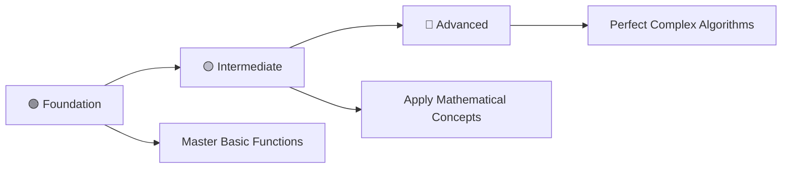

# 🛠️ Function Mastery: Complete C Programming Challenge

> **Master Functions Through 36 Progressive Programming Problems**

<div align="center">

[](https://en.wikipedia.org/wiki/C_(programming_language))
[](https://github.com/rohit528590/CGenesis/09_Function_Practice_Problems)
[](https://github.com/rohit528590/CGenesis/tree/main/09_Function_Practice_Problems)
[](https://github.com/rohit528590/CGenesis/tree/main/09_Function_Practice_Problems)
[](https://github.com/rohit528590/CGenesis/tree/main/09_Function_Practice_Problems)

### Welcome to the **Function Practice Problems** module of **CGenesis**! 🎯


*Master functions through **36 progressive challenges** covering fundamental concepts to advanced algorithms with real-world applications.*

</div>

---

## 📋 Table of Contents

- [📖 Overview](#-overview)
- [⚡ Quick Start Guide](#-quick-start-guide)
- [📚 Problem Categories](#-problem-categories)
- [🎯 Recommended Learning Path](#-recommended-learning-path)
- [🖥️ Essential Function Examples](#️-essential-function-examples)
- [🎓 What's Next?](#-whats-next)
- [🤝 Resources & Support](#-resources--support)

---

## 📖 Overview

Master **36 progressive function challenges** covering essential C programming concepts:

### 🎯 **Core Learning Areas**

- **📊 Mathematical Operations**: Basic arithmetic, statistics, and number theory
- **🔢 Algorithm Implementation**: Prime detection, sequences, and combinatorics  
- **🔬 Scientific Computing**: Geometry, conversions, and mathematical functions
- **🔄 Data Processing**: Comparisons, swapping, and logical operations
- **🛠️ Professional Practices**: Library usage, modular design, and code optimization

Transform theoretical knowledge into practical programming skills through hands-on problem solving.

---

## ⚡ Quick Start Guide

### Prerequisites

- Any C compiler (GCC, Dev-C++, Code::Blocks)
- Text editor or IDE
- Enthusiasm to learn! 🔥

### Getting Started

```bash
# Clone the repository
git clone https://github.com/rohit528590/CGenesis.git

# Change directory
cd CGenesis/09_Function_Practice_Problems

# Compile any program
gcc filename.c -o output

# Run the program
./output

# Example with Problem 1
gcc 01_time_based_greeting.c -o time_based_greeting
./time_based_greeting
```

---

## 📚 Problem Categories

### 🟢 **Foundation Level** (Problems 1-13)

*Build your function fundamentals with essential concepts*  

| # | 📁 **Problem** | 📊 **Difficulty** | 🔑 **Key Concepts** |
|---|---------|-------------------|--------------------------------------|
| 01 | [Time Based Greeting](01_time_based_greeting.c) | ⭐ | 🌅 Basic void functions and conditional logic |
| 02 | [Nationality Greeting](02_nationality_greeting.c) | ⭐ | 🌍 Multi-language functions and string handling |
| 03 | [Multiplication Table](03_multiplication_table.c) | ⭐ | 📊 Loop integration with functions |
| 04 | [Weather Categorization](04_weather_categorization.c) | ⭐⭐ | 🌡️ Conditional functions and temperature logic |
| 05 | [Sum Three Numbers](05_sum_three_numbers.c) | ⭐ | ➕ Parameter passing and return values |
| 06 | [Arithmetic Operations](06_arithmetic_operations.c) | ⭐⭐ | 🧮 Multiple calculations in single function |
| 07 | [Square Area Calculator](07_square_area_calculator.c) | ⭐ | 🔲 Geometric calculations and math functions |
| 08 | [Celsius To Fahrenheit](08_celsius_to_fahrenheit.c) | ⭐⭐ | 🌡️ Temperature conversion formulas |
| 09 | [Celsius To Kelvin](09_celsius_to_kelvin.c) | ⭐⭐ | ❄️ Scientific temperature scales |
| 10 | [Fahrenheit To Celsius](10_fahrenheit_to_celsius.c) | ⭐⭐ | 🔥 Reverse conversion logic |
| 11 | [Fahrenheit To Kelvin](11_fahrenheit_to_kelvin.c) | ⭐⭐ | 🔥 Multi-step temperature conversions |
| 12 | [Kelvin To Celsius](12_kelvin_to_celsius.c) | ⭐⭐ | 🧊 Absolute temperature handling |
| 13 | [Kelvin To Fahrenheit](13_kelvin_to_fahrenheit.c) | ⭐⭐ | ⚡ Complex formula implementation |

**🎯 Focus Areas:** Function basics, parameter passing, return values, simple calculations

---

### 🟡 **Intermediate Level** (Problems 14-25)

*Develop analytical thinking and optimization skills*  

| # | 📁 **Problem** | 📊 **Difficulty** | 🔑 **Key Concepts** |
|---|---------|-------------------|--------------------------------------|
| 14 | [Minimum Two Numbers](14_minimum_two_numbers.c) | ⭐⭐ | 🔍 Comparison functions and conditional returns |
| 15 | [Smallest Three Numbers](15_smallest_three_numbers.c) | ⭐⭐ | 🎯 Multiple parameter comparison logic |
| 16 | [Area Circle Rectangle](16_area_circle_rectangle.c) | ⭐⭐ | 🔶 Multiple geometric functions |
| 17 | [Gravitational Force Calculator](17_gravitational_force_calculator.c) | ⭐⭐⭐ | 🪐 Physics formulas and scientific computing |
| 18 | [Factorial Calculator](18_factorial_calculator.c) | ⭐⭐ | 🔢 Recursive thinking and mathematical functions |
| 19 | [Factorial Range Display](19_factorial_range_display.c) | ⭐⭐⭐ | 🔄 Loop-function integration and series |
| 20 | [Nth Fibonacci Number](20_nth_fibonacci_number.c) | ⭐⭐⭐ | 🌀 Sequence generation and algorithm design |
| 21 | [Fibonacci Sequence Display](21_fibonacci_sequence_display.c) | ⭐⭐⭐ | 📈 Series processing and optimization |
| 22 | [Sum Of Digits](22_sum_of_digits.c) | ⭐⭐ | 🔤 Digit extraction and number manipulation |
| 23 | [Star Pattern Printer](23_star_pattern_printer.c) | ⭐⭐ | ⭐ Pattern functions and nested loops |
| 24 | [Combinations nCr Calculator](24_combinations_ncr_calculator.c) | ⭐⭐⭐ | 🎲 Combinatorics and mathematical formulas |
| 25 | [Permutations nPr Calculator](25_permutations_npr_calculator.c) | ⭐⭐⭐ | 🔀 Permutation algorithms and factorial usage |

**🎯 Focus Areas:** Algorithm implementation, mathematical functions, pattern generation, optimization

---

### 🔴 **Advanced Level** (Problems 26-36)

*Master advanced function concepts and real-world applications*  

| # | 📁 **Problem** | 📊 **Difficulty** | 🔑 **Key Concepts** |
|---|---------|-------------------|--------------------------------------|
| 26 | [Pascals Triangle Basic](26_pascals_triangle_basic.c) | ⭐⭐⭐ | 🔺 Advanced pattern generation |
| 27 | [Pascals Triangle Centered](27_pascals_triangle_centered.c) | ⭐⭐⭐⭐ | 🎯 Alignment algorithms and spacing |
| 28 | [Swap With Temporary](28_swap_with_temporary.c) | ⭐⭐ | 🔄 Variable swapping and temporary storage |
| 29 | [Swap Without Temporary](29_swap_without_temporary.c) | ⭐⭐⭐ | ⚡ Advanced swapping without temp variables |
| 30 | [Power Calculator Library](30_power_calculator_library.c) | ⭐⭐ | 📚 Library function usage and math.h |
| 31 | [Power Function Custom](31_power_function_custom.c) | ⭐⭐⭐ | 💪 Custom power implementation |
| 32 | [Power Series Display](32_power_series_display.c) | ⭐⭐⭐ | 📊 Power series and mathematical sequences |
| 33 | [GCD Calculator](33_gcd_calculator.c) | ⭐⭐⭐⭐ | 🔍 Euclidean algorithm and number theory |
| 34 | [Prime Factors Finder](34_prime_factors_finder.c) | ⭐⭐⭐⭐ | 🔢 Prime factorization and advanced algorithms |
| 35 | [Square Root Newton](35_square_root_newton.c) | ⭐⭐⭐⭐ | 🔍 Numerical methods and precision handling |
| 36 | [First N Primes](36_first_n_primes.c) | ⭐⭐⭐⭐ | 🎯 Sieve algorithms and optimization techniques |

**🎯 Focus Areas:** Advanced algorithms, number theory, mathematical optimization, computational efficiency

---

### 🎯 **Recommended Learning Path**



**💡 Pro Tip**: Complete problems in sequence for optimal skill building!

---

## 🖥️ Essential Function Examples

### 1. Basic Function (No Return Value)

```c
void greet() {
    printf("Hello, World!\n");
}
// Usage:
greet();
```

### 2. Function with Return Value

```c
int add(int a, int b) {
    return a + b;
}
// Usage:
int sum = add(3, 5);
printf("Sum: %d\n", sum);
```

### 3. Passing Parameters by Value

```c
void printSquare(int n) {
    printf("Square: %d\n", n * n);
}
printSquare(4);
```

### 4. Composite Functions

```c
int multiply(int a, int b) {
    return a * b;
}
int squareOfSum(int x, int y) {
    int s = add(x, y);
    return multiply(s, s);
}
printf("%d\n", squareOfSum(2, 3));
```

### 5. Using a Library Function

```c
#include <math.h>
double root = sqrt(25.0);
printf("Square root: %.2f\n", root);
```

---

## 🎓 What's Next?

Ready to level up your C programming journey? Here's your personalized learning roadmap:

### 🚀 Immediate Next Challenge

- **🔍 [Recursion Practice Problems](../10_Recursion_Practice_Problems)** - Master recursive algorithms through 25 comprehensive challenges covering base cases, recursive calls, call stack understanding, and advanced recursive problem-solving techniques 🌀

### 🌟 Topics Awaiting You

- **📊 Data Structures: Arrays & 2D Arrays** - Master single and multi-dimensional arrays, memory layout, indexing, and matrix operations
- **🎯 Pointers & Memory Management** - Direct memory access, pointer arithmetic, and dynamic memory allocation
- **🔗 Advanced Pointer Concepts** - Multi-level pointers, pointer-to-pointer relationships, and complex data structure navigation

---

## 🤝 Resources & Support

<div align="center">

| 📚 **Resource Type** | 🔗 **Access Point** | 📝 **Description** |
|---------------------|---------------------|-------------------|
| **🐛 Bug Reports & Questions** | [Open an Issue](https://github.com/rohit528590/CGenesis/issues) | Report bugs or ask technical questions |
| **💬 Community Support** | [GitHub Issues](https://github.com/rohit528590/CGenesis/issues) | Get help with coding problems and technical questions |
| **🤝 Contribute** | [Fork Repository](https://github.com/rohit528590/CGenesis/fork) | Help improve the course for everyone |

</div>

---

<div align="center">

### 🌟 Ready to Master Functions?

**Choose your starting point and begin your coding journey!**

[](01_time_based_greeting.c)
[](14_minimum_two_numbers.c)
[](26_pascals_triangle_basic.c)

---

### 💪 Your Structured Learning Path

<div align="center">

```
🟢 Foundation Level      🟡 Intermediate Level      🟠 Advanced Level
   (Problems 1-13)          (Problems 14-25)           (Problems 26-36)
       ↓                        ↓                         ↓
   Basic Functions    Parameter Passing & Return    Modular Programming
```

**📈 Structured Path:** `Function Fundamentals` → `Parameter Mastery` → `Advanced Function Design`

</div>

---

### 🔗 **Support This Project**

<div align="center">

[](https://github.com/rohit528590/CGenesis/stargazers)
[](https://github.com/rohit528590/CGenesis/network/members)

**⭐ [Star this Repository](https://github.com/rohit528590/CGenesis) to show your support!**

</div>

*Happy Coding, future programmer! 🚀👨‍💻👩‍💻*  

</div>

<div align="center">
<sub>Built with ❤️ for C programming students | Based on proven learning progression | <a href="https://github.com/rohit528590/CGenesis">CGenesis Project</a></sub>
</div>
