# 🧩 Arrays & 2D Arrays in C - Complete Learning Guide

<div align="center">

[](https://en.wikipedia.org/wiki/C_(programming_language))
[](https://github.com/rohit528590/CGenesis/tree/main/11_Array_and_2D-Array)
[](https://github.com/rohit528590/CGenesis/tree/main/11_Array_and_2D-Array)
[](https://github.com/rohit528590/CGenesis/11_Array_and_2D-Array)
[](https://github.com/rohit528590/CGenesis/tree/main/12_Array_Practice_Problems)
[](https://github.com/rohit528590/CGenesis/tree/main/13_2D_Array_Practice_Problems)

### Welcome to the **Arrays & 2D Arrays** module of **CGenesis**! 🎯


*A comprehensive, structured journey through C programming arrays and matrices with hands-on practice, memory management techniques, and progressive skill development*  

</div>

---

## 📋 Table of Contents

- [🎯 What You'll Master](#-what-youll-master)
- [🚀 Quick Start](#-quick-start)
- [📚 Learning Structure](#-learning-structure)
- [🎮 Practice Challenges](#-practice-challenges)
- [🎯 Recommended Learning Path](#-recommended-learning-path)
- [🔥 Key Concepts with Examples](#-key-concepts-with-examples)
- [🎓 What's Next?](#-whats-next)
- [🤝 Resources & Support](#-resources--support)

---

## 🎯 What You'll Master

<table>
<tr>
<td width="50%">

### ⚡ **Arrays**

*Foundation of data organization*  

- ✅ Array declaration & initialization
- ✅ Element access & manipulation
- ✅ Array input/output operations
- ✅ Memory management concepts
- ✅ Array algorithms & patterns

</td>
<td width="50%">

### 🔄 **2D Arrays**

*Matrix operations and multi-dimensional data*  

- ✅ Matrix declaration & structure
- ✅ Row-column navigation
- ✅ Matrix mathematical operations
- ✅ Advanced traversal patterns
- ✅ Memory optimization techniques

</td>
</tr>
</table>

---

## 🚀 Quick Start

### 💻 **Get Started in 3 Steps**

```bash
# 1. Clone the repository
git clone https://github.com/rohit528590/CGenesis.git

# 2. Change directory
cd CGenesis/11_Array_and_2D-Array

# 3. Compile your first program
gcc 01_Array.c -o my_first_array

# 4. Run and see the magic!
./my_first_array
```

### 📋 **What You Need**

- ✅ Basic C knowledge (variables, loops, if-else)
- ✅ Any C compiler (GCC, Code::Blocks, Dev-C++)
- ✅ Text editor or IDE
- ✅ Enthusiasm to learn! 🎉

---

## 📚 Learning Structure

### 🌟 **Learning Path: Beginner → Expert**

### 🟢 Phase 1: Array Foundation

> *Start here if you're new to arrays*

| # | 📄 **File** | 📊 **Difficulty** | 🔑 **What You'll Learn** |
|---|------|--------------|------------------|
| 1 | [Array Basics](01_Array.c) | ⭐ | 🎯 Your first array operations |
| 2 | [Array Declaration](02_Decleration_of_array.c) | ⭐ | 📝 5 different declaration methods |
| 3 | [Array Quiz](03_Array_Quize.c) | ⭐ | 🧠 Test your array understanding |
| 4 | [Accessing Elements](04_Accessing_Elements_of_array.c) | ⭐ | 🔍 Element manipulation techniques |
| 5 | [Practice Quiz](05_Quize.c) | ⭐ | 🎮 Interactive array challenges |

### 🟡 Phase 2: 2D Array Mastery

> *Build matrix manipulation skills*

| # | 📄 **File** | 📊 **Difficulty** | 🔑 **What You'll Learn** |
|---|------|--------------|------------------|
| 6 | [2D Array Introduction](06_2D-Array.c) | ⭐⭐ | 🚀 Matrix fundamentals |
| 7 | [2D Element Access](07_Accessing_Elements_Of_2D-Array.c) | ⭐⭐ | 🎯 Advanced 2D navigation |
| 8 | [2D Array Quiz](08_Quize_on_2D-Array.c) | ⭐⭐ | 🧩 Matrix operation challenges |

### 🔴 Phase 3: Advanced Integration

> *Master function integration with arrays*

| # | 📄 **File** | 📊 **Difficulty** | 🔑 **What You'll Learn** |
|---|------|--------------|------------------|
| 9 | [Arrays with Functions](09_Array_On_Function.c) | ⭐⭐⭐ | 🔄 Pass arrays to functions |
| 10 | [Function Array Quiz](10_Quize_On_Function_Array.c) | ⭐⭐⭐ | 🎪 Advanced array operations |

---

## 🎮 Practice Challenges

### 📝 **Core Array Practice** - [Practice Problem Based on Arrays.txt](Practice_Questions_On_Arrays.txt)

### 📝 **2D Array Mastery** - [Practice Problem Based on 2D Arrays.txt](Practice_Questions_On_2D-Arrays.txt)

### 🏆 **Start with These Easy Problems**

<details>
<summary><strong>🥇 Level 1: Array Basics (Choose 3-5 to start)</strong></summary>

- [ ] **Student Marks System** - Store and calculate grades
- [ ] **Sum Calculator** - Add all array elements
- [ ] **Product Calculator** - Multiply all elements
- [ ] **Multiplication Table** - Store table in array
- [ ] **Max/Min Finder** - Find extreme values
- [ ] **Element Counter** - Count elements greater than X

</details>

<details>
<summary><strong>🥈 Level 2: Array Algorithms</strong></summary>

- [ ] **Array Reversal** - Reverse array in-place
- [ ] **Palindrome Checker** - Check if array reads same forwards/backwards
- [ ] **Missing Number** - Find missing element in sequence
- [ ] **Second Largest** - Find second maximum element
- [ ] **Duplicate Finder** - Locate repeated elements
- [ ] **Array Rotation** - Rotate elements left/right

</details>

<details>
<summary><strong>🥉 Level 3: 2D Array Challenges</strong></summary>

- [ ] **Matrix Addition** - Add two matrices
- [ ] **Matrix Maximum** - Find largest element
- [ ] **Matrix Transpose** - Switch rows and columns
- [ ] **Matrix Rotation** - Rotate 90° clockwise
- [ ] **Spiral Traversal** - Print matrix in spiral order
- [ ] **Wave Pattern** - Print in wave form

</details>

---

## 🎯 **Recommended Learning Path**

```mermaid
graph LR
    A[🟢 Foundation] --> B[🟡 2D Array Mastery]
    B --> C[🔴 Advanced Integration]
    C --> D[🎮 Practice Challenges]
    A --> E[Master Basic Arrays]
    B --> F[Matrix Operations]
    C --> G[Function Integration]
    D --> H[Real-World Solutions]
```



**💡 Pro Tip**: Progress systematically through each phase - master 1D arrays before 2D matrices, then apply skills with challenging practice problems!

---

## 🔥 Key Concepts with Examples

### 1. Array Declaration & Initialization

```c
// Method 1: Declaration only
int marks[5];

// Method 2: Declaration + Initialization
int numbers[5] = {10, 20, 30, 40, 50};

// Method 3: Partial initialization (rest = 0)
int scores[5] = {90, 85}; // {90, 85, 0, 0, 0}

// Method 4: Size determined by compiler
int grades[] = {95, 87, 92}; // Size = 3
```

### 2. Array Input/Output

```c
// Taking input from user
printf("Enter %d elements:\n", size);
for(int i = 0; i < size; i++) {
    scanf("%d", &arr[i]);
}

// Displaying array elements
printf("Array elements: ");
for(int i = 0; i < size; i++) {
    printf("%d ", arr[i]);
}
printf("\n");
```

### 3. Finding Maximum Element

```c
int findMax(int arr[], int size) {
    int max = arr[0];
    for(int i = 1; i < size; i++) {
        if(arr[i] > max) {
            max = arr[i];
        }
    }
    return max;
}
```

### 4. 2D Array Declaration & Operations

```c
// 2D array declaration
int matrix[3][3] = {{1,2,3}, {4,5,6}, {7,8,9}};

// Input 2D array
for(int i = 0; i < rows; i++) {
    for(int j = 0; j < cols; j++) {
        scanf("%d", &matrix[i][j]);
    }
}

// Display 2D array
for(int i = 0; i < rows; i++) {
    for(int j = 0; j < cols; j++) {
        printf("%d ", matrix[i][j]);
    }
    printf("\n");
}
```

### 5. Matrix Addition

```c
void addMatrices(int a[][MAX], int b[][MAX], int result[][MAX], int rows, int cols) {
    for(int i = 0; i < rows; i++) {
        for(int j = 0; j < cols; j++) {
            result[i][j] = a[i][j] + b[i][j];
        }
    }
}
```

### 6. Array Reversal (In-place)

```c
void reverseArray(int arr[], int size) {
    int start = 0, end = size - 1;
    while(start < end) {
        int temp = arr[start];
        arr[start] = arr[end];
        arr[end] = temp;
        start++;
        end--;
    }
}
```

### 7. Matrix Transpose

```c
void transpose(int matrix[][MAX], int transposed[][MAX], int rows, int cols) {
    for(int i = 0; i < rows; i++) {
        for(int j = 0; j < cols; j++) {
            transposed[j][i] = matrix[i][j];
        }
    }
}
```

---

## 🎓 What's Next?

Ready to level up your C programming journey? Here's your personalized learning roadmap:

### 🚀 Immediate Next Challenge

- **[📄 Array Practice Problems](../12_Array_Practice_Problems)** - Master array algorithms through 25+ hands-on challenges covering sorting, searching, manipulation, and optimization with complete solutions

- **[🎨 2D Array Practice Problems](../13_2D_Array_Practice_Problems)** - Master matrix operations with progressive challenges from basic traversal to advanced algorithms including rotation, spiral patterns, and mathematical operations with detailed solutions

### 🌟 Topics Awaiting You

- **Strings**: Character arrays and string manipulation
- **Pointers**: Dynamic memory allocation with arrays
- **Advanced Algorithms**: Sorting and searching techniques
- **Data Structures**: Linked lists using array concepts

---

## 🤝 Resources & Support

| 📚 **Resource Type** | 🔗 **Access Point** | 📄 **Description** |
|---------------------|---------------------|-------------------|
| **⚙️ Array Practice Problems** | [Array Practice Problems.txt](Practice_Questions_On_Arrays.txt) | 25+ array challenges to master fundamental concepts |
| **📊 2D Array Practice** | [2D Array Practice Problems.txt](Practice_Questions_On_2D-Arrays.txt) | 32+ matrix challenges to master 2D array concepts |
| **🛠 Bug Reports & Questions** | [Open an Issue](https://github.com/rohit528590/CGenesis/issues) | Report bugs or ask technical questions |
| **💬 Community Support** | [GitHub Issues](https://github.com/rohit528590/CGenesis/issues) | Get help with coding problems and technical questions |
| **🤝 Contribute** | [Fork Repository](https://github.com/rohit528590/CGenesis/fork) | Help improve the course for everyone |

---

<div align="center">

## 🚀 Ready to Master C Arrays & 2D Arrays?

**Follow the exact progression from your carefully crafted examples!**

[](01_Array.c)
[](06_2D-Array.c)
[](Practice_Questions_On_2D-Arrays.txt)

### 🌟 **Remember:**

*Every expert programmer started exactly where you are now. The key is consistent practice and curiosity to learn!*

---

### 💪 Your Structured Learning Path

<div align="center">

```
🟢 Foundation Phase      🟡 2D Array Mastery      🔴 Advanced Applications
   (Files 01-05)          (Files 06-08)             (57+ Practice Problems)
       ↓                       ↓                         ↓
   Array Fundamentals    Matrix Operations      Professional Programming
```

**📈 Progressive Journey:** `Array Basics` → `Matrix Mastery` → `Algorithm Excellence`

</div>

---

### 🔗 **Support This Project**

[](https://github.com/rohit528590/CGenesis/stargazers)
[](https://github.com/rohit528590/CGenesis/network/members)

**⭐ [Star this Repository](https://github.com/rohit528590/CGenesis) to show your support!**

*Happy Coding, future programmer! 🚀👨‍💻👩‍💻*  

<sub>Built with ❤️ for C programming students | Based on proven learning progression | <a href="https://github.com/rohit528590/CGenesis">CGenesis Project</a></sub>
</div>
