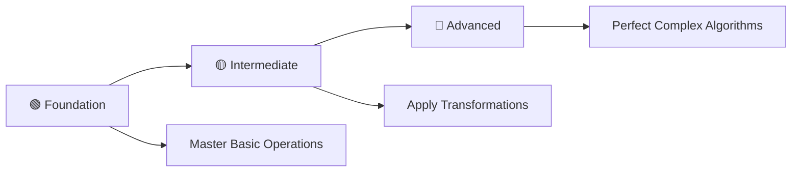

# 📊 2D Array Practice Problems in C

> **Master 2D Arrays and Matrix Operations Through 27 Progressive Programming Problems**

<div align="center">

[](https://en.wikipedia.org/wiki/C_(programming_language))
[](https://github.com/rohit528590/CGenesis/tree/main/13_2D-Array_Practice_Problems)
[](https://github.com/rohit528590/CGenesis/tree/main/13_2D-Array_Practice_Problems)
[](https://github.com/rohit528590/CGenesis/tree/main/13_2D-Array_Practice_Problems)
[](https://github.com/rohit528590/CGenesis/tree/main/13_2D-Array_Practice_Problems)

### Welcome to the **2D Array Practice Problems** module of **CGenesis**! 🎯


*Master 2D Arrays and Matrix Operations through **27 progressive challenges** covering fundamental concepts to advanced algorithms with real-world applications.*

</div>

---

## 📖 Overview

Master **27 progressive 2D array challenges** covering essential matrix programming concepts:

### 🎯 **Core Learning Areas**

- **📊 Matrix Fundamentals**: Array declaration, initialization, and basic operations
- **🔢 Mathematical Operations**: Matrix addition, multiplication, and mathematical computations
- **🔄 Matrix Transformations**: Transpose, rotation, and in-place modifications
- **🌊 Traversal Patterns**: Wave printing, spiral traversals, and custom pattern generation
- **🎯 Advanced Algorithms**: Complex matrix manipulations and optimization techniques

Transform theoretical 2D array knowledge into practical programming expertise through systematic problem-solving.

---

## 📚 Problem Categories

### 📝 Problem List - [2D Arrays (Matrix) Practice Questions To Be Solved](00_Practice_Questions_Based_On_2D-Arrays.txt)

### 🟢 **Foundation Level** (Problems 1-9)

*Build your 2D array fundamentals with essential concepts*  

| #  | 📁 **Problem**                                         | 📊 **Difficulty** | 🔑 **Key Concepts** |
|----|---------------------------------------------------|-------------------|---------------------|
| 1  | [Initialize Matrix with Value N](01_initialize_matrix_with_n.c)      | ⭐ | 🔄 Matrix initialization and user input |
| 2  | [Sum of All Matrix Elements](02_sum_all_matrix_elements.c)                 | ⭐ | ➕ Matrix traversal and element summation |
| 3  | [Add Two Matrices](03_add_two_matrices.c) | ⭐⭐ | 🔢 Matrix addition and parallel processing |
| 4  | [Find Maximum Element](04_find_maximum_element.c)     | ⭐ | 🔍 Search algorithms and comparison operations |
| 5  | [Find Minimum Element and Position](05_find_minimum_element_position.c) | ⭐ | 🔍 Position tracking and minimum value search |
| 6  | [Calculate Submatrix Sum](06_submatrix_sum_calculation.c) | ⭐⭐ | 📊 Range-based operations and boundary handling |
| 7  | [Row with Maximum Sum](07_row_with_maximum_sum.c) | ⭐⭐ | ⬆️ Row-wise summation and optimization |
| 8  | [Row with Most Ones in Binary Matrix](08_row_with_most_ones.c)   | ⭐⭐ | 🔄 Binary matrix operations and counting |
| 9  | [Print Matrix Transpose](09_print_matrix_transpose.c) | ⭐⭐ | 🔀 Matrix transformation fundamentals |

---

### 🟡 **Intermediate Level** (Problems 10-18)

*Develop matrix manipulation and transformation skills*  

| #  | 📁 **Problem**                                         | 📊 **Difficulty** | 🔑 **Key Concepts** |
|----|---------------------------------------------------|-------------------|---------------------|
| 10 | [Store Transpose in Separate Matrix](10_store_transpose_separate_matrix.c) | ⭐⭐ | 💾 Memory allocation and matrix storage |
| 11 | [Transpose Square Matrix In-Place](11_transpose_square_matrix_inplace.c) | ⭐⭐⭐ | 🎯 In-place algorithms and space optimization |
| 12 | [Rotate Matrix 90° Clockwise (Print)](12_rotate_matrix_ninety_clockwise.c)     | ⭐⭐⭐ | 🔄 Geometric transformations and rotation |
| 13 | [Rotate Matrix 90° Clockwise In-Place](13_rotate_matrix_inplace_clockwise.c)       | ⭐⭐⭐⭐ | ⚡ Advanced in-place rotation algorithms |
| 14 | [Rotate Matrix Using While Loop](14_rotate_matrix_while_loop.c)       | ⭐⭐⭐ | 🌀 Alternative loop structures for rotation |
| 15 | [Multiply Two Matrices](15_multiply_two_matrices.c)          | ⭐⭐⭐ | 🧮 Matrix multiplication and nested iterations |
| 16 | [Odd Row-wise Wave Print](16_odd_row_wave_print.c)  | ⭐⭐⭐ | 📈 Odd-indexed row traversal patterns |
| 17 | [Reverse Odd Rows In-Place](17_reverse_odd_rows_inplace.c) | ⭐⭐⭐⭐ | 🔢 In-place row reversal transformations |
| 18 | [Even Row-wise Wave Print](18_even_row_wave_print.c) | ⭐⭐⭐ | 🪜 Even-indexed row traversal patterns |

---

### 🔴 **Advanced Level** (Problems 19-27)

*Master complex matrix algorithms and optimization techniques*  

| #  | 📁 **Problem**                                         | 📊 **Difficulty** | 🔑 **Key Concepts** |
|----|---------------------------------------------------|-------------------|---------------------|
| 19 | [Reverse Even Rows In-Place](19_reverse_even_rows_inplace.c)              | ⭐⭐⭐⭐ | 🗺️ Advanced in-place even row transformations |
| 20 | [Even Column-wise Wave Print](20_even_column_wave_print.c)              | ⭐⭐⭐ | 🎯 Even-indexed column traversal algorithms |
| 21 | [Vertical Flip Matrix (Print)](21_vertical_flip_matrix_print.c)    | ⭐⭐⭐⭐ | ⚡ Vertical matrix transformations and row reordering |
| 22 | [Reverse Rows In-Place (Vertical Flip)](22_reverse_rows_inplace_flip.c)   | ⭐⭐⭐⭐⭐ | 🗺️ Complex in-place vertical flip operations |
| 23 | [Reverse Even Columns In-Place](23_reverse_even_columns_inplace.c)                 | ⭐⭐⭐⭐ | 🧭 Advanced even column manipulation algorithms |
| 24 | [Odd Column-wise Wave Print](24_odd_column_wave_print.c)               | ⭐⭐⭐ | 🌳 Odd-indexed column traversal patterns |
| 25 | [Reverse Odd Columns In-Place](25_reverse_odd_columns_inplace.c)                   | ⭐⭐⭐⭐⭐ | 🔀 Complex in-place odd column operations |
| 26 | [Spiral Order Traversal](26_spiral_order_traversal.c)            | ⭐⭐⭐⭐⭐ | 🌀 Spiral matrix traversal algorithms |
| 27 | [Generate Spiral Matrix](27_generate_spiral_matrix.c)            | ⭐⭐⭐⭐⭐ | 🗼 Complex spiral matrix generation algorithms |

---

### 🎯 **Recommended Learning Path**



**💡 Pro Tip**: Start with basic matrix operations, then progress to transformations and finally master complex traversal patterns!

---

## 🖥️ Classic 2D Array Examples

### 1. Matrix Initialization

```c
int matrix[3][3];
// Initialize with user input
for (int i = 0; i < 3; i++) {
    for (int j = 0; j < 3; j++) {
        scanf("%d", &matrix[i][j]);
    }
}
```

### 2. Matrix Addition

```c
void addMatrices(int a[][3], int b[][3], int result[][3], int rows, int cols) {
    for (int i = 0; i < rows; i++) {
        for (int j = 0; j < cols; j++) {
            result[i][j] = a[i][j] + b[i][j];
        }
    }
}
```

### 3. Matrix Transpose

```c
void transpose(int matrix[][3], int rows, int cols) {
    for (int i = 0; i < rows; i++) {
        for (int j = 0; j < cols; j++) {
            printf("%d ", matrix[j][i]);
        }
        printf("\n");
    }
}
```

### 4. Spiral Matrix Traversal

```c
void spiralPrint(int matrix[][4], int rows, int cols) {
    int top = 0, bottom = rows - 1;
    int left = 0, right = cols - 1;
    
    while (top <= bottom && left <= right) {
        // Print top row
        for (int i = left; i <= right; i++)
            printf("%d ", matrix[top][i]);
        top++;
        
        // Print right column
        for (int i = top; i <= bottom; i++)
            printf("%d ", matrix[i][right]);
        right--;
        
        // Print bottom row
        if (top <= bottom) {
            for (int i = right; i >= left; i--)
                printf("%d ", matrix[bottom][i]);
            bottom--;
        }
        
        // Print left column
        if (left <= right) {
            for (int i = bottom; i >= top; i--)
                printf("%d ", matrix[i][left]);
            left++;
        }
    }
}
```

### 5. Matrix Rotation (90° clockwise)

```c
void rotate90(int matrix[][3], int n) {
    // Transpose
    for (int i = 0; i < n; i++) {
        for (int j = i; j < n; j++) {
            int temp = matrix[i][j];
            matrix[i][j] = matrix[j][i];
            matrix[j][i] = temp;
        }
    }
    
    // Reverse each row
    for (int i = 0; i < n; i++) {
        for (int j = 0; j < n/2; j++) {
            int temp = matrix[i][j];
            matrix[i][j] = matrix[i][n-1-j];
            matrix[i][n-1-j] = temp;
        }
    }
}
```

---

## 🎓 What's Next?

Ready to level up your C programming journey? Here's your personalized learning roadmap:

### 🚀 Immediate Next Challenge

- **🔗 [Pointers & Memory Management](../14_Pointers)** - Master dynamic memory allocation, pointer arithmetic, and advanced memory management techniques for complex data structures 🌀

### 🌟 Topics Awaiting You

- **📚 Strings & Character Arrays** - Text processing, string manipulation, and character-based algorithms
- **🔗 Advanced Data Structures** - Linked lists, stacks, queues, and tree structures

---

## 🤝 Resources & Support

<div align="center">

| 📚 **Resource Type** | 🔗 **Access Point** | 📝 **Description** |
|---------------------|---------------------|-------------------|
| **🛠 Bug Reports & Questions** | [Open an Issue](https://github.com/rohit528590/CGenesis/issues) | Report bugs or ask technical questions |
| **💬 Community Support** | [GitHub Issues](https://github.com/rohit528590/CGenesis/issues) | Get help with coding problems and technical questions |
| **🤝 Contribute** | [Fork Repository](https://github.com/rohit528590/CGenesis/fork) | Help improve the course for everyone |

</div>

---

<div align="center">

### 🌟 Ready to Master 2D Arrays?

**Choose your starting point and begin your coding journey!**

[](01_initialize_matrix_with_n.c)
[](10_store_transpose_separate_matrix.c)
[](19_reverse_even_rows_inplace.c)

---

### 💪 Your Structured Learning Path

<div align="center">

```
🟢 Foundation Level      🟡 Intermediate Level    🔴 Advanced Level
   (Problems 1-9)          (Problems 10-18)         (Problems 19-27)
       ↓                        ↓                       ↓
   Basic Operations        Matrix Transformations   Complex Algorithms
```

**📈 Structured Path:** `Basic Matrix Operations` → `Transformations & Rotations` → `Advanced Traversal Patterns`

</div>

---

### 🔗 **Support This Project**

<div align="center">

[](https://github.com/rohit528590/CGenesis/stargazers)
[](https://github.com/rohit528590/CGenesis/network/members)

**⭐ [Star this Repository](https://github.com/rohit528590/CGenesis) to show your support!**

</div>

*Happy Coding, future programmer! 🚀👨‍💻👩‍💻*  

</div>

<div align="center">
<sub>Built with ❤️ for C programming students | Based on proven learning progression | <a href="https://github.com/rohit528590/CGenesis">CGenesis Project</a></sub>
</div>
