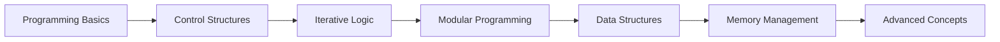

# 🚀 CGenesis: Comprehensive C Programming Mastery Guide

<div align="center">


**A Complete Journey from Fundamentals to Advanced C Programming Mastery**  

[](https://github.com/rohit528590/CGenesis)
[](https://github.com/rohit528590/CGenesis)
[](https://github.com/rohit528590/CGenesis/issues)
[](https://github.com/rohit528590/CGenesis)

</div>

---

## 📖 Table of Contents

- [🌟 Project Overview](#-project-overview)
- [👨‍💻 About the Developer](#-about-the-developer)
- [🎯 Learning Objectives](#-learning-objectives)
- [📚 Structured Learning Path](#-structured-learning-path)
- [🗂️ Module Breakdown](#️-module-breakdown)
- [🎮 Practical Projects](#-practical-projects)
- [💡 Problem-Solving Practice](#-problem-solving-practice)
- [🚀 Quick Start Guide](#-quick-start-guide)
- [📊 Progress Dashboard](#-progress-dashboard)
- [🤝 Contributing Guidelines](#-contributing-guidelines)
- [📄 License Information](#-license-information)

---

## 🌟 Project Overview

**CGenesis** is a comprehensive, structured learning repository designed to guide students and developers through a complete C programming journey. This project transforms the traditional approach to learning C by providing:

### Key Features

- **📖 Progressive Learning Structure** - From basic syntax to advanced concepts
- **🎯 Hands-On Practice** - Over 200 carefully crafted problems
- **🏗️ Real-World Projects** - Practical applications to solidify understanding
- **📊 Visual Progress Tracking** - Monitor your growth throughout the journey
- **🔍 Code Quality Focus** - Industry-standard practices and documentation

### Why Choose CGenesis?

This repository bridges the gap between theoretical knowledge and practical application, ensuring learners develop both conceptual understanding and implementation skills essential for professional software development.

---

## 👨‍💻 About the Developer

### My Programming Journey 🌱

Welcome to my foundational programming repository! As a passionate computer science student, I've documented my complete learning journey from writing my first "Hello, World!" program to mastering advanced concepts like dynamic memory management and algorithmic problem-solving.

**My Learning Philosophy:**

- **Foundation First** - Building solid fundamentals before advancing
- **Practice-Driven Learning** - Learning through implementation and iteration  
- **Documentation Excellence** - Maintaining clear, comprehensive records
- **Community Contribution** - Sharing knowledge to help fellow learners

This repository represents more than just code—it's a testament to disciplined learning, continuous improvement, and the commitment to mastering programming fundamentals that will serve as the foundation for my career in software engineering.

---

## 🎯 Learning Objectives

Upon completing this comprehensive program, you will have mastered:

### Core Programming Concepts

- **💾 Memory Management** - Understanding stack, heap, and pointer manipulation
- **🧠 Algorithmic Thinking** - Problem decomposition and solution design
- **⚡ Performance Optimization** - Time and space complexity analysis
- **🔧 System-Level Programming** - Low-level operations and hardware interaction

### Professional Development Skills

- **📝 Code Quality** - Writing clean, maintainable, and well-documented code
- **🐛 Debugging Proficiency** - Systematic problem identification and resolution
- **🏗️ Project Structure** - Organizing code for scalability and collaboration
- **📊 Testing Methodologies** - Verification and validation techniques

---

## 📚 Structured Learning Path

Our curriculum follows a scientifically-designed progression to ensure optimal knowledge retention:



Each module builds upon previous knowledge while introducing new concepts at an appropriate pace.

---

## 🗂️ Module Breakdown

### 📘 Module 1: Programming Fundamentals

**Directory:** [`01_Programming_Fundamentals`](01_Basics)

**Core Concepts:**

- ✅ Variable declaration, initialization, and scope
- ✅ Data types, constants, and type conversion
- ✅ Operators and expression evaluation
- ✅ Input/output operations and formatting
- ✅ Debugging and error handling basics

**📝 Practice Set:** [`02_Fundamentals_Problem_Set`](02_Basics_Practice_Problems) **(22 Problems)**

- Mathematical computations and formula applications
- Unit conversions and scientific calculations
- Financial calculations and percentage operations
- Geometric area and volume computations

---

### 🔀 Module 2: Decision-Making Structures

**Directory:** [`03_Decision_Structures`](03_If-Else)

**Core Concepts:**

- ✅ Conditional statements (`if`, `if-else`, `nested if`)
- ✅ Logical and relational operators
- ✅ Switch-case implementations
- ✅ Ternary operator usage
- ✅ Complex condition evaluation

**🔀 Practice Set:** [`04_Decision_Making_Problems`](04_If-Else_Practice_Problems) **(24 Problems)**

- Eligibility and validation systems
- Grade calculation and classification
- Mathematical relationship analysis
- Character and data type validation
- Business logic implementation

---

### 🔄 Module 3: Iterative Control Systems

**Directory:** [`05_Loop_Structures`](05_Loops)

**Core Concepts:**

- ✅ Loop variations (`while`, `do-while`, `for`)
- ✅ Loop control statements (`break`, `continue`)
- ✅ Nested iteration patterns
- ✅ Infinite loop prevention and handling
- ✅ Performance optimization in loops

**🔄 Practice Set:** [`06_Iteration_Problem_Set`](06_Loops_Practice_Problems) **(41 Problems)**

- Series generation and mathematical sequences
- Number theory and prime calculations
- Digital manipulation and palindrome detection
- Statistical calculations and data processing

**🎨 Advanced Practice:** [`07_Pattern_Design_Challenges`](07_Pattern_Printing_Practice_Problems) **(33 Patterns)**

- Geometric shape generation
- ASCII art and visual programming
- Matrix pattern implementation
- Algorithmic art creation

---

### ⚙️ Module 4: Modular Programming & Recursion

**Directory:** [`08_Functions_And_Recursion`](08_Function_and_Recursion)

**Core Concepts:**

- ✅ Function design and implementation
- ✅ Parameter passing mechanisms
- ✅ Return value optimization
- ✅ Recursive algorithm design
- ✅ Function overloading concepts
- ✅ Library function utilization

**⚙️ Practice Set:** [`09_Function_Mastery_Problems`](09_Function_Practice_Problems) **(36 Problems)**

- Modular code design challenges
- Mathematical function libraries
- Utility function development
- Code reusability implementation

**🔄 Advanced Practice:** [`10_Recursion_Deep_Dive`](10_Recursion_Practice_Problems) **(25 Problems)**

- Classic recursive algorithms
- Tree traversal implementations
- Divide-and-conquer strategies
- Dynamic programming foundations

---

### 📊 Module 5: Data Structure Foundations

**Directory:** [`11_Arrays_And_Matrices`](11_Array_and_2D-Array)

**Core Concepts:**

- ✅ Single-dimensional array operations
- ✅ Multi-dimensional array manipulation
- ✅ Array-pointer relationships
- ✅ Memory layout understanding
- ✅ Efficient data processing techniques

**📊 Practice Set:** [`12_Array_Practice_Problems`](12_Array_Practice_Problems) **(27 Problems)**

- Statistical analysis and data processing
- Array manipulation and transformation
- Search algorithms and element detection
- Mathematical sequence generation
- Optimization techniques and performance analysis
- Palindrome and pattern recognition
- Subarray operations and rotations

---

### 🎯 Module 6: Memory Management & Pointers

**Status:** 🔄 *Development in Progress*

**Planned Concepts:**

- Advanced pointer operations and arithmetic
- Dynamic memory allocation strategies
- Memory leak prevention and debugging
- Pointer-to-pointer implementations

---

### 📝 Module 7: String Processing & Manipulation

**Status:** 🔄 *Development in Progress*

**Planned Concepts:**

- String library functions and custom implementations
- Character array manipulation
- Text processing algorithms
- Pattern matching and parsing

---

### 🏗️ Module 8: Custom Data Types & Structures

**Status:** 🔄 *Development in Progress*

**Planned Concepts:**

- Structure definition and implementation
- Union operations and memory optimization
- Typedef usage and code clarity
- Complex data organization patterns

---

### 🔄 Module 9: Algorithm Analysis & Sorting

**Status:** 🔄 *Development in Progress*

**Planned Concepts:**

- Time and space complexity analysis
- Classic sorting algorithm implementations
- Algorithm comparison and optimization
- Performance benchmarking

---

### 📁 Module 10: File Operations & I/O Management

**Status:** 🔄 *Development in Progress*

**Planned Concepts:**

- File handling operations (read/write/append)
- Binary vs. text file processing
- Error handling in file operations
- Data persistence strategies

---

### 💾 Module 11: Advanced Memory Management

**Status:** 🔄 *Development in Progress*

**Planned Concepts:**

- Dynamic allocation (`malloc`, `calloc`, `realloc`)
- Memory optimization techniques
- Garbage collection concepts
- Memory profiling and debugging

---

## 🎮 Practical Projects

### 🎲 Project Alpha: Intelligent Number Guessing System

**Technical Overview:**
A console-based interactive game demonstrating fundamental programming concepts with enhanced user experience.

**Implementation Features:**

- **Random Number Generation:** Using `rand()` and `srand()` for unpredictable gameplay
- **Input Validation:** Comprehensive error handling and user input sanitization
- **Adaptive Difficulty:** Dynamic hint system based on player performance
- **Statistics Tracking:** Game history and performance analytics

**Skills Demonstrated:**

- Control flow mastery
- User interface design
- Algorithm implementation
- Data validation techniques

---

### 🐍 Project Beta: Strategic Game Engine (Snake-Water-Gun)

**Technical Overview:**
An advanced implementation of the classic game with enhanced features and robust game state management.

**Implementation Features:**

- **Game State Management:** Comprehensive tracking of game progression
- **AI Opponent:** Basic artificial intelligence for single-player mode
- **Score Persistence:** Data storage and retrieval systems
- **Performance Analytics:** Win/loss statistics and pattern analysis

**Skills Demonstrated:**

- Object-oriented thinking
- State machine implementation
- Data persistence
- Algorithm optimization

---

## 💡 Problem-Solving Practice

### Comprehensive Problem Collection

Our repository includes **200+ problems** across multiple difficulty levels:

| Category | Problems | Focus Area |
|----------|----------|------------|
| **Fundamentals** | 22 | Basic syntax and operations |
| **Decision Logic** | 24 | Conditional programming |
| **Iteration Mastery** | 41 | Loop-based solutions |
| **Visual Programming** | 33 | Pattern generation |
| **Functional Design** | 36 | Modular programming |
| **Recursive Thinking** | 25 | Advanced algorithms |

### Problem Difficulty Distribution

```
🟢 Beginner    (40%) - Foundation building
🟡 Intermediate (35%) - Skill development  
🔴 Advanced    (25%) - Mastery challenges
```

---

## 🚀 Quick Start Guide

### 🛠️ Environment Setup

**Required Tools:**

- **Compiler:** GCC 9.0+ or equivalent C compiler
- **IDE/Editor:** Visual Studio Code (recommended) or preferred text editor
- **Operating System:** Windows 10+, macOS 10.15+, or Linux distribution
- **Version Control:** Git for repository management

### ⚡ Installation Process

1. **Repository Setup**

   ```bash
   # Clone the repository
   git clone https://github.com/rohit528590/CGenesis.git
   
   # Navigate to project directory
   cd CGenesis
   
   # Verify directory structure
   ls -la
   ```

2. **Compiler Verification**

   ```bash
   # Check GCC installation
   gcc --version
   
   # Verify compiler functionality
   gcc --help
   ```

3. **First Program Execution**

   ```bash
   # Navigate to fundamentals module
   cd 01_Programming_Fundamentals
   
   # Compile your first program
   gcc 01_First_Program.c -o hello_world
   
   # Execute the compiled program
   ./hello_world
   ```

**Expected Output:**
```
Hello, World!
Welcome to CGenesis - Your C Programming Journey Begins!
```

### 📖 Recommended Study Approach

1. **Sequential Learning** - Complete modules in order for optimal knowledge building
2. **Active Practice** - Solve all problems before advancing to the next module
3. **Project Implementation** - Build projects to apply theoretical knowledge
4. **Code Review** - Regularly review and refactor your solutions
5. **Community Engagement** - Participate in discussions and help fellow learners

---

## 📊 Progress Dashboard

### Current Development Status

| Module | Completion | Problems | Code Quality | Documentation |
|--------|------------|----------|--------------|---------------|
| Programming Fundamentals | ✅ 100% | 22/22 | ⭐⭐⭐⭐⭐ | ✅ Complete |
| Decision Structures | ✅ 100% | 24/24 | ⭐⭐⭐⭐⭐ | ✅ Complete |
| Loop Structures | ✅ 100% | 41/41 | ⭐⭐⭐⭐⭐ | ✅ Complete |
| Pattern Design | ✅ 100% | 33/33 | ⭐⭐⭐⭐⭐ | ✅ Complete |
| Functions & Recursion | ✅ 100% | 61/61 | ⭐⭐⭐⭐⭐ | ✅ Complete |
| Arrays & Matrices | 🔄 85% | 15/20 | ⭐⭐⭐⭐ | 🔄 In Progress |
| Memory Management | 🔄 15% | 2/25 | ⭐⭐⭐ | 🔄 Planning |

### Learning Milestones Achieved

- ✅ **200+ Problems Solved** - Comprehensive practice across all difficulty levels
- ✅ **2 Complete Projects** - Real-world application development
- ✅ **Advanced Concepts Mastered** - Functions, recursion, and pattern design
- ✅ **Industry-Standard Documentation** - Professional code commenting and README files

---

## 🤝 Contributing Guidelines

We welcome contributions from the programming community! Here's how you can help improve CGenesis:

### 🌟 Ways to Contribute

- **🐛 Bug Reports** - Identify and report issues in code or documentation
- **💡 Feature Suggestions** - Propose new modules, problems, or improvements
- **📝 Documentation Enhancement** - Improve explanations and code comments
- **🔧 Code Optimization** - Suggest performance improvements and best practices
- **🎯 Additional Problems** - Create new practice problems with solutions
- **🏗️ Project Ideas** - Propose new practical projects for hands-on learning

### 📋 Contribution Process

1. **Fork the Repository**

   ```bash
   # Fork via GitHub interface or CLI
   gh repo fork rohit528590/CGenesis
   ```

2. **Create Feature Branch**

   ```bash
   # Create and switch to feature branch
   git checkout -b feature/your-improvement-name
   ```

3. **Implement Changes**
   - Follow existing code style and conventions
   - Add comprehensive comments and documentation
   - Test all code thoroughly before submission

4. **Submit Pull Request**

   ```bash
   # Commit your changes
   git commit -m "Add: Brief description of your improvement"
   
   # Push to your fork
   git push origin feature/your-improvement-name
   ```

5. **Code Review Process**
   - Automated testing will verify code quality
   - Maintainers will review and provide feedback
   - Collaboration on refinements if needed

### 📏 Quality Standards

- **Code Quality:** Clean, readable, and well-commented code
- **Documentation:** Clear explanations and usage examples
- **Testing:** Thoroughly tested with multiple test cases
- **Consistency:** Adherence to existing project structure and naming conventions

---

## 📄 License Information

This project is licensed under the **MIT License**, promoting open-source collaboration and educational use.

**Key License Features:**

- ✅ **Free to Use** - No restrictions on personal or commercial use
- ✅ **Modification Rights** - Freedom to adapt and improve the code
- ✅ **Distribution Allowed** - Share with others while maintaining attribution
- ✅ **No Warranty** - Use at your own discretion and responsibility

For complete license details, see the [LICENSE](LICENSE) file in the repository root.

---

## 🙏 Acknowledgments

### Special Recognition

**Language Creators:**

- **Dennis Ritchie** - Creator of the C programming language and foundational computing concepts
- **Brian Kernighan** - Co-author of "The C Programming Language" and programming methodology pioneer

**Community Contributors:**

- **Open Source Community** - For continuous support, feedback, and collaborative improvement
- **Educational Institutions** - For providing foundational computer science education
- **Fellow Developers** - For code reviews, suggestions, and knowledge sharing
- **GitHub Community** - For fostering collaborative learning and development

### Educational Resources

This repository has been enriched by insights from:

- Classic computer science textbooks and academic papers
- Industry best practices and coding standards
- Real-world software development experiences
- Community feedback and peer learning

---

<div align="center">

### 🌟 Support This Project

**Found CGenesis helpful? Consider:**

[](https://github.com/rohit528590/CGenesis)
[](https://github.com/rohit528590/CGenesis/fork)
[](#)

---

**Happy Coding! 🚀**  

*"The journey of a thousand programs begins with a single 'Hello, World!'"*  


[](https://github.com/rohit528590)


</div>

